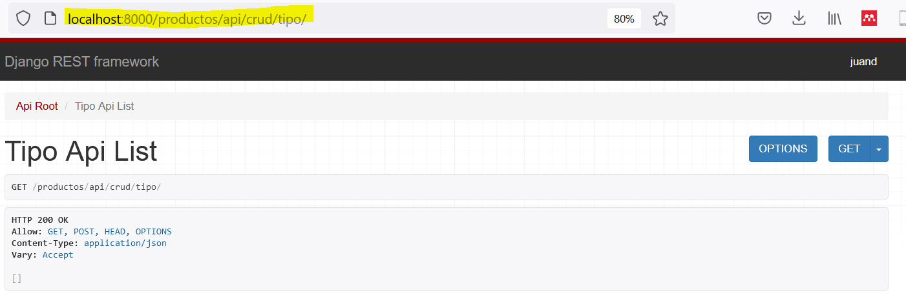
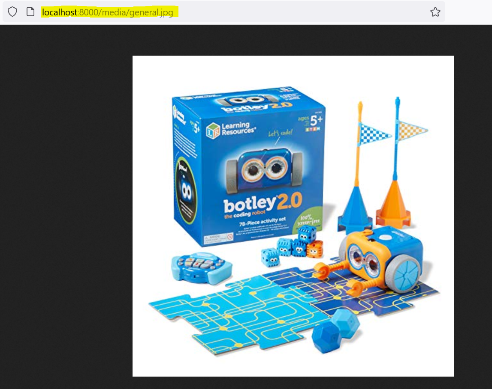
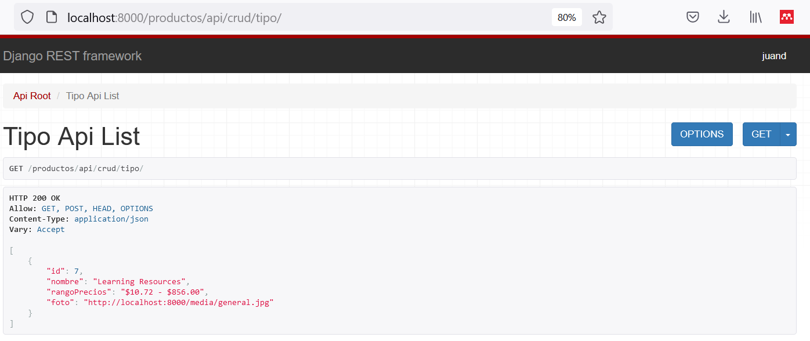
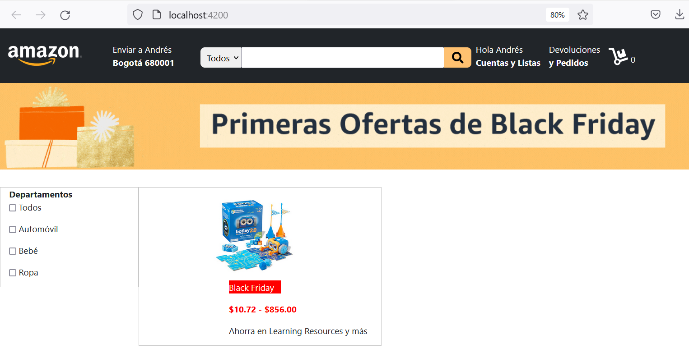

<div align="center">
    <h1>Comunicación HTTP</h1>
</div>

## Introducción

Teniendo listo nuestro desarrollo frontend y backend, sólo hace falta brindar la comunicación entre ellos. En este punto, es __necesario__ que tengamos nuestro desarrollo backend corriendo y que las __API's se encuentren en correcto funcionamiento__. Para el desarrollo de este taller, necesitaremos que la API de categorías de productos esté andando y en funcionamiento, como se aprecia a continuación.


<p align="center"><i>Figura 1.</i> API funcional en la dirección <a href="">http://localhost:8000/productos/api/crud/tipo/</a>.</p>

Anexo al presente taller encontrarás los desarrollos frontend y backend ya acoplados para emplearlo como referencia.

## 1. Configuración Backend

Si bien la API funciona de manera adecuada, para poder utilizar las direcciones de las _imágenes_ que contiene debemos hacer un cambio en la configuración del proyecto.

<h3>1.1. settings.py</h3>

Añadiremos la siguiente configuración para el manejo de archivos estáticos y multimedia:

```PYTHON
STATIC_ROOT = os.path.join(BASE_DIR, 'static/')

STATICFILES_DIRS = (
    os.path.join(BASE_DIR, 'staticfiles'),
    )

MEDIA_ROOT =  os.path.join(BASE_DIR, 'media')
MEDIA_URL = '/media/'
```

Lo anterior habilitará las direcciones de las imágenes, documentos y videos obtenidos a través de las API's.

Por cuestiones de seguridad, django intentará inhabilitar cualquier conexión con nuestras API's. Para permitir la comunicación, con el frontend, debemos instalar la librería `corseheaders` de la siguiente forma: `python -m pip install django-cors-headers`

```PYTHON
INSTALLED_APPS = [
    ...
    'corsheaders',
    ...
]

MIDDLEWARE = [
    ...,
    'corsheaders.middleware.CorsMiddleware',
    'django.middleware.common.CommonMiddleware',
    ...,
]

CORS_ORIGIN_WHITELIST = [
    "http://localhost:4200",
    "http://localhost:8000"
]
```

<h3>1.2. urls.py</h3>

Ahora, añadiremos las direcciones:

```PYTHON

from django.conf.urls.static import static
from django.conf import settings

...

urlpatterns += static(settings.STATIC_URL, document_root=settings.STATIC_ROOT)
urlpatterns += static(settings.MEDIA_URL, document_root=settings.MEDIA_ROOT)
```

En este punto, al probar las direcciones de las imágenes nos aparecerá lo siguiente como respuesta:




## 2. Servicio Angular

Además de la creación de componentes, Angular cuenta con la posibilidad de crear _servicios_. Un servicio se trata de una categoría reusable en cualquier componente y se diferencia de este debido a que busca brindar una funcionalidad específica; mientras que la función de un componente se centra en la experiencia de usuario.

En ese sentido, crearemos un servicio para el manejo de las conexiones HTTP con nuestras API's. Empezamos creando nuestro servicio, lo llamaremos `HttpService`. Ejecutamos en consola el siguiente comando: `ng g s http`

### 2.1. app.module.ts

Iniciaremos importando la librería `HttpClientModule` para poder usar las comunicaciones HTTP en nuestro proyecto.

```TS
import { HttpClientModule } from '@angular/common/http';

...

imports: [
    ...,
    HttpClientModule
  ]
```

### 2.2. http-service.service.ts

Ahora, adaptaremos nuestro servicio para que permita la comunicación con API's.


```TS
import { Injectable } from '@angular/core';
import { HttpClient } from '@angular/common/http';
import { Observable } from 'rxjs';

@Injectable({
  providedIn: 'root'
})
export class HttpService {

  dominio = "http://localhost:8000/";


  constructor(private http:HttpClient) { }

  getProductos(): Observable<any> {
    return this.http.get(this.dominio + "productos/api/crud/tipo");
  }

}
```

### 2.3. productos.component.ts

Ahora, reemplazaremos el diccionario manual creado en el primer taller de desarrollo con Angular por el contenido de nuestra API de la siguiente forma.

```TS
import { HttpService } from '../http.service';

categoriasProductos:Map<string, Map<string, any>> = new Map<string, Map<string, any>>();

  
constructor(private router:Router, private app:AppComponent, private api:HttpService) { }   

ngOnInit():void {
    ...
    this.obtenerCategorias();
}

obtenerCategorias():void {
    this.api.getProductos()
        .subscribe(
        data =>{
            for (let categoria of data) {
            this.categoriasProductos.set(categoria.nombre, new Map<string, string>([
                ["precios", categoria.rangoPrecios],
                ["img", categoria.foto]
            ]));
            }
        }
        );
}
```

Las variables __rangoPrecios__ y __foto__ las obtiene directamente de la API, por lo que debes asegurarte de que existan en la API. Por ejemplo:



Con base en lo registrado en la API obtendrás el siguiente resultado:


