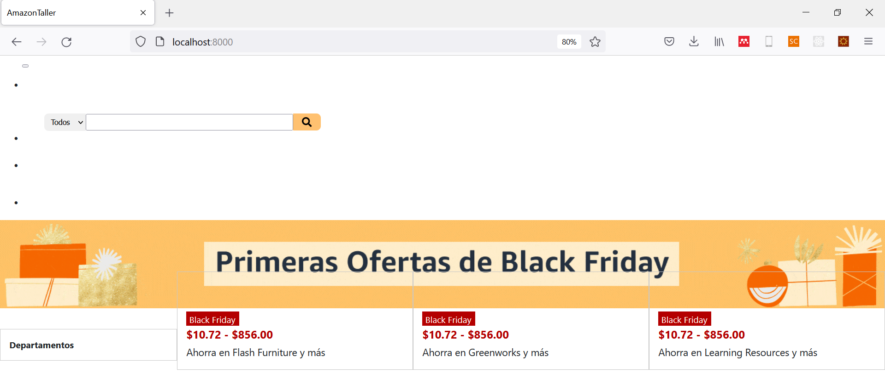
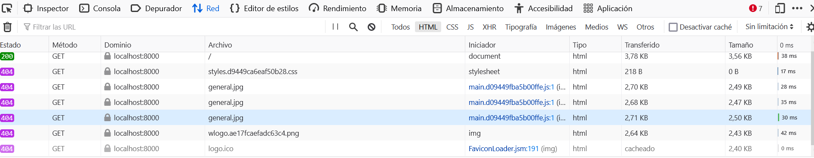
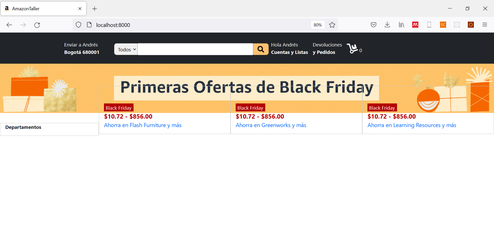

<h1 align="center">Acople de proyectos Backend y Frontend</h1>

## Introducción

En este punto, ya hemos visto cómo comunicar nuestros proyectos a través de las API's. Sin embargo, estaban funcionando con puertos distintos; es decir: 

* Angular: http://localhost:4200
* Django:  http://localhost:8000

Para hacer el despliegue de nuestro desarrollo, es necesario que ambos funcionen bajo el mismo puerto: el puerto 8000.

Lo primero que debemos hacer es crear una carpeta vacía en nuestro desarrollo Backend (en la misma dirección donde se encuentra el archivo `manage.py`). La podemos llamar _Frontend_.

## 1. Angular

Nos dirijimos a nuestro proyecto Angular a construir y configurar el compilador (__build__).

### 1.1. angular.json

Buscamos la sección de configuración del build y actualizamos la dirección de la carpeta vacía __Frontend__ que creamos en nuestro proyecto django. Es en esta carpeta donde se guardará todo el desarrollo frontend compilado.

```JSON
"build": {
    "builder": "@angular-devkit/build-angular:browser",
    "options": {
    "outputPath": "RUTA",
    "index": "src/index.html",
    "main": "src/main.ts",
    ...
```

Lo único que debes hacer es cambiar el contenido del `outputPath` por la dirección en donde se encuentre la carpeta Frontend. Por ejemplo, si tu proyecto tiene la siguiente estructura:

```
└─── Aplicación web
|       └─── AngularProject
|       |           └─── src
|       |           angular.json
|       |           ...
|       └─── DjangoProject
|       |           └─── Frontend
|       |           manage.py
|       |           ...
```

Entonces, el output path quedaría de la siguiente forma:

```JSON
"build": {
    "options": {
    "outputPath": "../DjangoProject/Frontend",
```

Ahora, ejecutaremos en consola el siguiente comando: `ng build`, lo que compilará el proyecto y creará en la carpeta _Frontend_ un único archivo HTML que  resume el proyecto frontend.

## 2. Django

Lo único que nos hace falta es acoplar el contenido del frontend (localizado en la carpeta _Frontend_) en nuestro proyecto django.

<h3>2.1. settings.py</h3>

Iniciamos haciendo un ligero cambio en nuestro proyecto.

```PYTHON
TEMPLATES = [
    {
        'DIRS': [os.path.join(BASE_DIR, 'Frontend/')],
        ...
]
```

Esta configuración permitirá encontrar el archivo __index.html__, obtenido como producto de la compilación del capítulo anterior.

Ahora, haremos una configuración de los archivos estáticos:

```PYTHON
STATICFILES_DIRS = (
os.path.join(BASE_DIR, 'staticfiles'),
os.path.join(BASE_DIR, 'Frontend')
)
```

Ejecutamos el siguiente comando en consola: `python manage.py collectstatic`

<h3>2.2. ExEcommerce/views.py</h3>

Ahora, necesitamos ligar el dominio de nuestro desarrollo con una vista _genérica_. Para ello, crearemos un archivo llamado `views.py` en la carpeta general de nuestro proyecto. Tendrá el siguiente contenido:

```PYTHON
from django.views import View
from django.shortcuts import render

class LandingPage(View):
    templeate = "index.html"
    def get(self, request):
        return render(request, self.templeate)
```

### ExEcommerce/urls.py

Añadiremos esta vista en las direcciones del proyecto, de la siguiente forma:

```PYTHON
from .views import *

urlpatterns = [
    ...,
    path('', LandingPage.as_view())
]
```

<h3>2.3. Frontend/index.html</h3>

Por defecto, nuestro desarrollo frontend presenta un problema en la forma en cómo se estipulan las importaciones de los diferentes documentos que requiere para su ejecución. Todas las importaciones las encuentra en la dirección `static/...`, por lo que debemos anteponer la palabra `static/` en cada una de estas importaciones. Por ejemplo:

__HTML original:__

```HTML
<script src="runtime.e3bf7755335579de.js" type="module"></script><script src="polyfills.9bd9464340c55959.js" type="module"></script><script src="scripts.b720b1a211162d87.js" defer></script><script src="main.d09449fba5b00ffe.js" type="module"></script>
```

__HTML ajustado:__

```HTML
<script src="static/runtime.e3bf7755335579de.js" type="module"></script><script src="static/polyfills.9bd9464340c55959.js" type="module"></script><script src="static/scripts.b720b1a211162d87.js" defer></script><script src="static/main.d09449fba5b00ffe.js" type="module"></script>
```

Al haber efectuado este cambio, y al ejecutar el servidor local del proyecto (`python manage.py runserver`), deberías encontrar la siguiente respuesta en la dirección principal del servidor: `localhost:8000`



Para que nos muestre todo el contenido estético de nuestro desarrollo de la forma en como lo deseamos, debemos asegurarnos que __todas las importaciones antepongan la palabra `static/`__. Para saber qué importaciones presentan inconvenientes, puedes guiarte con la herramienta de red del navegador, que debería verse, más o menos, así:



Una vez culmines con la mayoría de ajustes, el documento tendrá la siguiente forma:



Tiene inconveniente con las imágenes estáticas, por lo que deberás ajustar el proyecto angular para que __no__ emplee imágenes estáticas directamente, sino que las tome de la dirección static. Por ejemplo, para el logo de Amazon (ubicado en `app.component.css`), deberás cambiar esto:

```CSS
.navbar-brand {
    background-image: url("../assets/wlogo.png");
    width: 10%;
    padding-bottom: 5rem;
    margin-right: 2.5rem;
    background-size: 100% 100%;
}
```

Por esto:

```CSS
.navbar-brand {
    background-image: url("http://localhost:8000/static/wlogo.png");
    width: 10%;
    padding-bottom: 5rem;
    margin-right: 2.5rem;
    background-size: 100% 100%;
}
```

De esta forma, te aseguras que el contenido estático los obtenga de la dirección `static` del proyecto django, por lo que sólo tendrás que hacer estos ajustes para cada imagen estática del proyecto Angular. Una vez termines, ejecutas nuevamente el comando `ng build` en Angular y el comando `python manage.py collectstatic` en Django; además de repetir este paso (2.3).