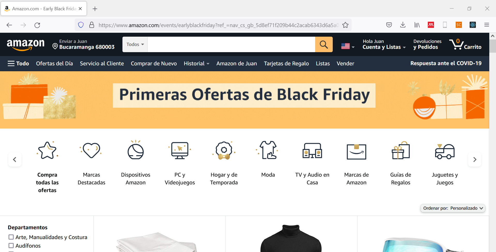
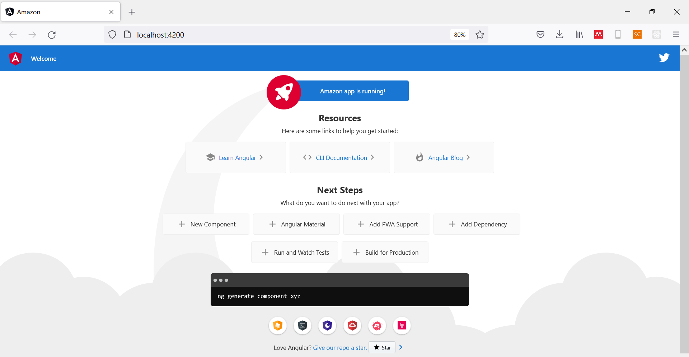
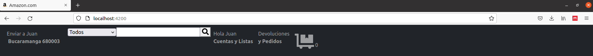
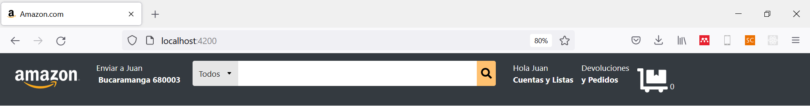
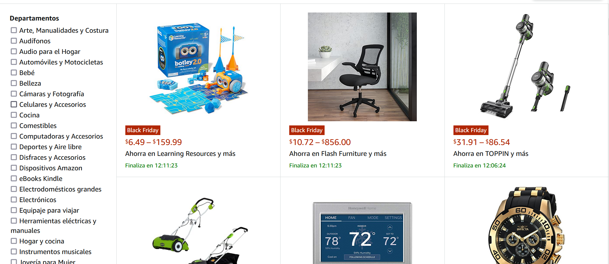
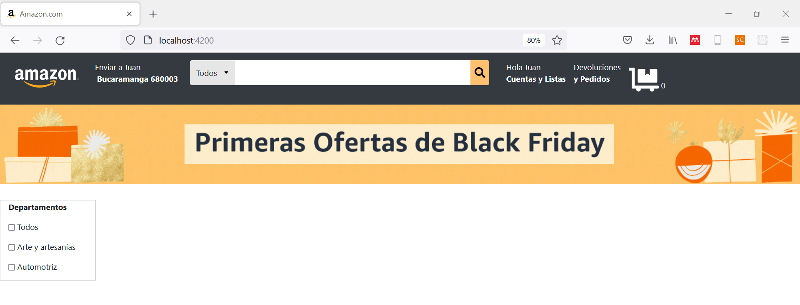
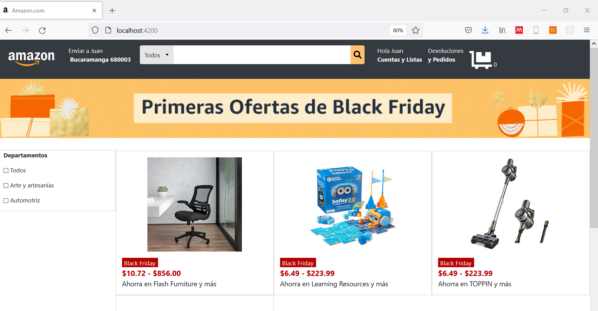

<div align="center">
    <h1>Taller 1</h1>
</div>

## Introducción

Angular es una interesante y poderosa herramienta de desarrollo frontend que subdivide un proyecto en distintos componentes de desarrollo, que, a su vez, puede tener múltiples subcomponentes, para proyectos de alta complejidad. En esta serie de talleres, construiremos el desarrollo frontend de la sección de productos de una plataforma de comercio electrónico con Angular. 

## Problema

Nuestro problema objetivo será replicar el desarrollo frontend de Amazon, en la sección de _"Ofertas del día"_, como se aprecia a continuación.



<p align="center"><i>Figura 1.</i> Problema objetivo.</p>

## 1. Generalidades

Iniciamos construyendo nuestro proyecto Angular. En una ubicación de interés, creamos el proyecto con el comando en consola: `ng new Amazon`, lo que generará lo siguiente:

```
Amazon   
└───e2e
└───src
|   └───App
|   └───assets 
|   └───environments
|       favicon.ico
|       index.html
|       angular.json
|       karma.conf.js
|       package.json   
|   ...
```

Como puedes apreciar, la creación del proyecto de Angular conlleva a la construcción de una serie de archivos y carpetas. Cada uno de ellos representa una porción de nuestro proyecto. Algunos de estos archivos se emplean para la configuración de este o para la generación de la lógica o estética del proyecto. Angular se encarga de descargarnos todas las librerías y herramientas requeridas para el despliegue del proyecto. A continuación, describiremos los más importantes e influyentes que emplearemos para nuestro desarrollo Frontend.

* __node_modules:__ contiene todas las librerías requeridas para la construcción del proyecto.
* __src:__ hace referencia a los archivos fuente de nuestro proyecto.
    * _app:_ consiste en la __base__ de nuestro proyecto. Contiene los archivos HTML, CSS y TypeScript principales del desarrollo frontend. También será la sección en donde encontraremos todos los componentes de nuestro proyecto.
    * _assets:_ en esta sección es donde dispondremos de todos los archivos personalizados de nuestro proyecto (imágenes, audios, pdf, etc).
    * _environments:_ contiene los ambientes de desarrollo.
    * _index.html:_ se trata del documento HTML principal del proyecto. Contiene las bases generales del proyecto.
    * _styles.css:_ contiene los estilos CSS genéricos de nuestro proyecto.
* __angular.json:__ contiene la información general de configuración del proyecto.

Para probar nuestro desarrollo frontend podemos ejecutar el comando `ng serve --open`, lo que nos ejecutará un servidor local para observar los cambios de nuestro proyecto en tiempo real. Al ejecutarlo por primera vez, obtendrás el siguiente resultado:



<p align="center"><i>Figura 2.</i> Aplicación angular inicial.</p>

Para utilizar __Bootstrap__ en nuestro proyecto, descargaremos los archivos [css](https://cdn.jsdelivr.net/npm/bootstrap@5.1.3/dist/css/bootstrap.min.css) y [js](https://cdn.jsdelivr.net/npm/bootstrap@5.1.3/dist/js/bootstrap.bundle.min.js) simplemente accediendo a los enlaces y guardando el código, con el nombre _bootstrap_ y la extensión correspondiente, en la carpeta __assets__. Una vez tengamos los archivos _bootstrap.css_ y _bootstrap.js_, los agregaremos en __angular.json__ de la siguiente forma:

```JSON
"styles": [
  "src/styles.css",
  "src/assets/bootstrap.css"
],
"scripts": [
  "src/assets/bootstrap.js"
]
```

Para nuestro desarrollo, emplearemos una serie de emojis web conocidos como _Font awesome_; para agregarlos, sólo debemos ejcutar el comando `ng add @fortawesome/angular-fontawesome@0.10.0`

## 2. Base del proyecto

La base de nuestro proyecto consiste en la estética, y la lógica, que se mantendrá durante __todo__ nuestro desarrollo frontend. Para este caso particular, consiste en la cabecera del proyecto.

### 2.1. index.html

La primera configuración que estableceremos será la de la construcción del documento HTML principal del proyecto, que lo encontramos en: __Amazon/src/index.html__. Originalmente, el archivo presenta el siguiente contenido:

```HTML
<!doctype html>
<html lang="en">
<head>
  <meta charset="utf-8">
  <title>Amazon</title>
  <base href="/">
  <meta name="viewport" content="width=device-width, initial-scale=1">
  <link rel="icon" type="image/x-icon" href="favicon.ico">
</head>
<body>
  <app-root></app-root>
</body>
</html>

```

En este contenido inicial se puede observar que se presenta una etiqueta `<app-root></app-root>`. Esta etiqueta hace referencia al contenido raíz de la aplicación (un __componente__ del proyecto). En esta sección, cambiaremos el logo de Angular por el de Amazon, y añadiremos algunas fuentes de letra similares a las empleadas por Amazon, de la siguiente forma:

```HTML
<!doctype html>
<html lang="en">
<head>
  <meta charset="utf-8">
  <title>Amazon.com</title>
  <base href="/">
  <meta name="viewport" content="width=device-width, initial-scale=1">
  <link rel="icon" type="image/x-icon" href="assets/logo.ico">
  <link rel="preconnect" href="https://fonts.googleapis.com">
  <link rel="preconnect" href="https://fonts.gstatic.com" crossorigin>
  <link href="https://fonts.googleapis.com/css2?family=Lato:wght@300&display=swap" rel="stylesheet"> 
</head>
<body>
  <app-root></app-root>
</body>
</html>

```

### 2.2. app.component.ts

En esta sección aplicaremos la lógica general de nuestra cabecera: importaremos los íconos y añadiremos parte de la funcionalidad al motor de búsqueda, entre otros. 

```TS
import { Component, OnInit } from '@angular/core';
import { faSearch, faDollyFlatbed } from '@fortawesome/free-solid-svg-icons';

@Component({
  selector: 'app-root',
  templateUrl: './app.component.html',
  styleUrls: ['./app.component.css']
})
export class AppComponent implements OnInit {
  title = 'Amazon';
  usuario = "Juan";
  ubicacion = "Bucaramanga";
  zip = "680003";
  opcionesFiltrado:Array<string> = [
    "Todos",
    "Arte y artesanías",
    "Automotriz"
  ];
  numArt:number = 0;

  //Íconos
  faSearch = faSearch;
  faCash = faDollyFlatbed;

  constructor() {
   }

  ngOnInit(): void {
    
  }

}
```

### 2.3. app.module.ts

Para poder emplear los íconos web de _font awersome_, importaremos el compomente de íconos que descargamos anteriormente de la siguiente forma:

```TS
import { BrowserModule } from '@angular/platform-browser';
import { NgModule } from '@angular/core';

import { AppRoutingModule } from './app-routing.module';
import { AppComponent } from './app.component';
import { FontAwesomeModule } from '@fortawesome/angular-fontawesome';

@NgModule({
  declarations: [
    AppComponent,
  ],
  imports: [
    BrowserModule,
    AppRoutingModule,
    FontAwesomeModule
  ],
  providers: [],
  bootstrap: [AppComponent]
})
export class AppModule { }
```

Para mayor información, puedes dirigirte al repositorio [GitHub de FortAwesome](https://github.com/FortAwesome/angular-fontawesome).


### 2.4. app.component.html

La etiqueta `<app-root>` hace referencia al componente base de nuestro proyecto, que se encuentra en: __Amazon/src/app/app.component.html__. El contenido original corresponde a TODO el desarrollo visual que se pudo apreciado en la Figura 2. Eliminaremos este contenido y, en su lugar, construiremos la cabecera de Amazon, de la siguiente forma:

```HTML
<nav class="navbar navbar-expand-lg navbar-dark bg-dark">
  <button class="navbar-toggler" type="button" data-toggle="collapse" data-target="#navbarSupportedContent" aria-controls="navbarSupportedContent" aria-expanded="false" aria-label="Toggle navigation">
    <span class="navbar-toggler-icon"></span>
  </button>
  <a class="navbar-brand" href="#"></a>
  
  <div class="collapse navbar-collapse" id="navbarSupportedContent">
    <ul class="navbar-nav mr-auto">
      <li class="nav-item active">
        <a class="nav-link" href="#">
          Enviar a {{usuario}}
          <br>
          <p><i class="fas fa-map-marker-alt"></i> <b style="margin-left:0.25rem">{{ubicacion}} {{zip}}</b></p>
        </a>
      </li>
      <form class="form-inline my-2 my-lg-0 search-form">
        <select style="margin-left:1rem;" name="" id="">
          <option *ngFor = "let opt of opcionesFiltrado;" value="{{opt}}">{{opt}}</option>
        </select>
        <input class="mr-sm-2 busqueda" id="search" type="search" aria-label="Search">
        <button class="my-2 my-sm-0 boton-busqueda" id="search" type="submit"><fa-icon [icon]="faSearch" class="fa-lg"></fa-icon></button>
      </form>
      <li class="nav-item active">
        <a class="nav-link" href="#">
          Hola {{usuario}}
          <br>
          <p><b>Cuentas y Listas</b></p>
        </a>
      </li>
      <li class="nav-item active">
        <a class="nav-link" href="#">
          Devoluciones
          <br>
          <p><b>y Pedidos</b></p>
        </a>
      </li>
      <li class="nav-item active">
        <a class="nav-link" href="#"><fa-icon [icon]="faCash" class="fa-3x"></fa-icon> {{numArt}}</a>
      </li>
    </ul>
  </div>
</nav>
```

Lo anterior, nos dará como resultado:



### 2.5. app.component.css

Añadiremos los siguientes estilos para garantizar la estética de nuestro menú de navegación.

```CSS
.navbar-brand {
    background-image: url("../assets/wlogo.png");
    width: 150px;
    background-size: 100% 100%;
    padding-bottom: 80px;
}

.search-form {
    height: 5rem;
    width: 40rem;
}

select {
    background: url("data:image/svg+xml,<svg height='10px' width='10px' viewBox='0 0 16 16' fill='%23000000' xmlns='http://www.w3.org/2000/svg'><path d='M7.247 11.14 2.451 5.658C1.885 5.013 2.345 4 3.204 4h9.592a1 1 0 0 1 .753 1.659l-4.796 5.48a1 1 0 0 1-1.506 0z'/></svg>") no-repeat;
    background-position: calc(100% - 0.75rem) center !important;
    -moz-appearance:none !important;
    -webkit-appearance: none !important; 
    appearance: none !important;
    padding-right: 2rem !important;
    background-color: rgb(230, 230, 230);
    width: 5.6rem;
    padding-left:0.5rem;
    padding-right: 0.5rem;
    border: none;
    border-radius: 0.25rem 0 0 0.25rem;
    padding-bottom: 0.8rem;
    padding-top: 0.8rem;
    color: #272727;
    margin-bottom: 1rem;
}

#search {
    padding:0.5rem;
    border: none;
    padding-bottom: 0.8rem;
    padding-top: 0.8rem;
    margin-bottom: 1rem;
}

.busqueda {
    width: 75.5%;
}

.boton-busqueda {
    position:relative; 
    left: 0%; 
    bottom: 0%;
    border: none;
    border-radius: 0 0.25rem 0.25rem 0;
    background-color: rgb(255, 193, 112);
}

.boton-busqueda:hover {
    background-color: rgb(255, 183, 88);
}
```

Obteniendo como resultado la cabecera de nuestro desarrollo frontend.



## 3. Componente de productos

Ahora, construiremos el componente de productos, en el cual se ofertarán las diferentes subcategorías de productos. Para ello, ejecutaremos el siguiente comando en consola: `ng g c productos`

* `ng` le informa a la consola que se desea utilizar un comando Angular.
* `g` hace referencia a un cambio global en la estructura del proyecto.
* `c` se refiere a la adición de un nuevo componente.
* `productos` se trata del nombre de la aplicación que queremos construir.

Este comando nos efectuará un cambio en la estructura de nuestro proyecto de la siguiente forma:

```
Amazon   
|   └───app
|       └───productos
|               productos.component.html
|               productos.component.css
|               productos.component.ts
|               productos.component.spec.ts
|       ...
```

En esta sección, nuestro objetivo es construir lo siguiente:



<p align="center"><i>Figura  3.</i> Categorías de productos.</p>

Como puedes observar, de forma resumida, el objetivo es construir:

* _Sección de filtros:_ permite agrupar las subcategorías de diferentes productos, lo puedes observar en la izquierda de la imagen.
* _Subcategorías:_ distribuye la información en tres columnas con la descripción general de la subcategoría, una fotografía y un margen de precios.

### 3.1. app.component.html

Realizaremos una pequeña adición al final del documento para especificarle que deseamos añadir nuestro componente de productos al desarrollo HTML de la siguiente forma:

```HTML
...
<app-productos></app-productos>
```

Esta adición hace referencia a una extensión del documento HTML, informándole a Angular que utilizaremos el componente de productos.

### 3.2. app.component.ts

Para aprovechar el uso de las categorías de productos definidas en la sección anterior, aprenderemos a utilizar diferentes opciones de almacenamiento local (en el navegador, no en el servidor). En un desarrollo frontend, se puede almacenar información en el navegador de nuestros usuarios para utilizarla en cualquier sección de nuestro desarrollo frontend. Desde Angular, disponemos de las siguientes opciones:

* __Cookies:__ seguro que alguna vez has oído hablar sobre las _cookies_ en diferentes sitios web. Se trata de unidades de almacenamiento básicas que permiten almacenar cualquier tipo de información, entre ellas: variables numéricas, diccionarios, listas, etc. Tiene un espacio de almacenamiento limitado (sólo 4KB). Tienen un margen de tiempo de vida.
* ___Local storage:___ opción de almacenamiento moderno por el lado del cliente. Permite almacenar hasta 5MB por dominio.

Para este desarrollo particular utilizaremos el _local storage_. Lo aprovecharemos para guardar la información del usuario y los filtros de búsqueda. Para ello, cambiaremos el contenido de la sección `ngOnInit` de la siguiente forma:

```TS
ngOnInit(): void {
    //Almacenamiento de información
    localStorage.setItem("opciones", JSON.stringify(this.opcionesFiltrado));
    localStorage.setItem("numArt", this.numArt.toString());
    localStorage.setItem("usuario", this.usuario);
  }

```

El método `setItem` permite almacenar información mediante un nombre, o palabra clave. El contenido a almacenar se trata de variables de texto. Para el caso de estructuras de datos (listas, arrays o diccionarios) empleamos `JSON.stringify` para convertir la estructura en una variable de texto.

En este punto, ya tenemos almacenada la información del usuario, los número de artículos y las categorías (opciones de filtrado) de nuestros productos, y podemos utilizarlas en cualquier parte de nuestro desarrollo.


### 3.3. Sección de filtros

Muchas veces, para realizar un desarrollo con Angular es necesario construir las diferentes secciones de nuestro componente en paralelo. En el caso de la sección de filtros:

#### 3.3.1 productos.component.ts

En paralelo, debemos importar del _local storage_ las opciones de filtrado de nuestro desarrollo, de la siguiente forma:

```TS
usuario:string = "";
opcionesFiltrado:Array<string> = [];

ngOnInit(): void {
    this.usuario = localStorage.getItem("usuario") || "";
    this.opcionesFiltrado = JSON.parse(localStorage.getItem("opciones") || '[]');
  }
```

Empleamos el método `getItem` para obtener la información de interés.

#### 3.3.2 productos.component.html

Iniciamos clasificando nuestro desarrollo en dos secciones: _contenido-categorias_ y _categorias-productos_. En la primera definiremos el uso de filtros, mientras que en la segunda ubicaremos __todas__ las categorías de nuestros productos.

```HTML


<div class="contenido-categorias">
    <div class="categorias-genericas">
        <p><b>Departamentos</b></p>
        <div class="categoria" *ngFor="let opcion of opcionesFiltrado;">
            <p><input type="checkbox"> {{opcion}}</p>
        </div>
    </div>
    <div class="categorias-productos">
    </div>
</div>
```

#### 3.3.3 productos.component.css

Finalmente, emplearemos los siguientes estilos:

```CSS
.contenido-categorias {
    margin-top: 2rem;

}

.categorias-genericas {
    width: 12rem;
    padding-left: 1rem;
    border: solid rgb(200, 200, 200);
    border-width: 1px;
}
```


Obteniendo el siguiente resultado visual:




### 3.4. Sucategorías

#### 3.4.1 productos.component.ts

Ahora, importaremos las diferentes categorías y la información general de los productos a mostrar:

```TS
import { Component, OnInit } from '@angular/core';

@Component({
  selector: 'app-productos',
  templateUrl: './productos.component.html',
  styleUrls: ['./productos.component.css']
})
export class ProductosComponent implements OnInit {

  categoriasProductos:Map<string, Map<string, string>> = new Map<string, Map<string, string>>([
    ["Flash Furniture", new Map<string, string>([
      ["precios", "$10.72 - $856.00"],
      ["img", "../assets/categorias/Flash Furniture/general.jpg"]
    ])],
    ["Greenworks", new Map<string, string>([
      ["precios", "$10.72 - $856.00"],
      ["img", "../assets/categorias/Greenworks/general.jpg"]
    ])],
    ["Learning Resources", new Map<string, string>([
      ["precios", "$10.72 - $856.00"],
      ["img", "../assets/categorias/Learning Resources/general.jpg"]
    ])]
  ]);

  usuario:string = "";
  opcionesFiltrado:Array<string> = [];

  constructor() { }

  ngOnInit(): void {
    this.usuario = localStorage.getItem("usuario") || '{}';
    this.opcionesFiltrado = JSON.parse(localStorage.getItem("opciones") || '[]');
    for (let cat in this.categoriasProductos) {
      console.log(cat);
    }
  }

}
```

#### 3.4.2 productos.component.html

Adaptaremos nuestro documento HTML de la siguiente forma:

```HTML


<div class="contenido-categorias">
    <div class="categorias-genericas">
        <p><b>Departamentos</b></p>
        <div class="categoria" *ngFor="let opcion of opcionesFiltrado;">
            <p><input type="checkbox"> {{opcion}}</p>
        </div>
    </div>
    <div class="categorias-productos grid">
        <div class="categoria-producto" *ngFor="let categoria of categoriasProductos | keyvalue">
            
            <div class="cont-promo">
                <p class="promocion">Black Friday</p>
                <p class="precios">{{categoria.value.get('precios')}}</p>
                <p style="margin-top: -1rem; font-size: 18px;">Ahorra en {{categoria.key}} y más</p>
            </div>
        </div>
    </div>
</div>
```

#### 3.4.3 productos.component.css

Finalmente, emplearemos los siguientes estilos para el control estético:

```CSS
.promo {
    width: 100%;
}

.contenido-categorias {
    margin-top: 2rem;
    position: relative;
}


.categorias-genericas {
    width: 20%;
    padding-left: 1rem;
    border: solid rgb(200, 200, 200);
    border-width: 1px;
}

.categorias-productos {
    position: relative;
    width: 80%;
    margin-top: -10.1rem;
    margin-left: 20%;
}

.categoria-producto {
    border: solid rgb(200, 200, 200);
    border-width: 1px;
    padding-top: 1rem;
}

.img-cat {
    width: 60%;
    margin-left: 20%;
}

.cont-promo {
    padding-top: 1rem;
    padding-left: 1rem;
}

.promocion {
    background-color: rgb(180, 0, 0);
    color: white;
    width: 6rem;
    padding: 0.1rem 0.1rem 0 0;
    text-align: center;
}

.precios {
    color: rgb(180, 0, 0);
    font-weight: bold;
    font-size: 20px;
    margin-top: -1rem;
}

.grid {
    display: grid;
    grid-template-columns: 1fr 1fr 1fr;
}

@media screen and (max-width:600px) {
    .categorias-genericas {
        display: none;
    }
    .categorias-productos {
        margin-left: 0;
        margin-top: 0;
        width: 100%;
    }
    .grid {
        grid-template-columns: 1fr;
    }
}
```

Lo que nos dará como resultado:



