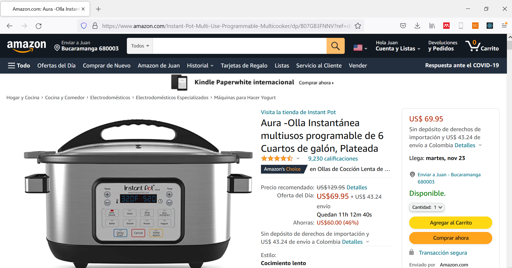
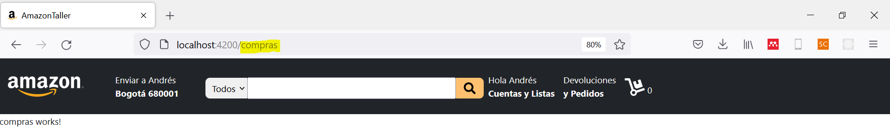
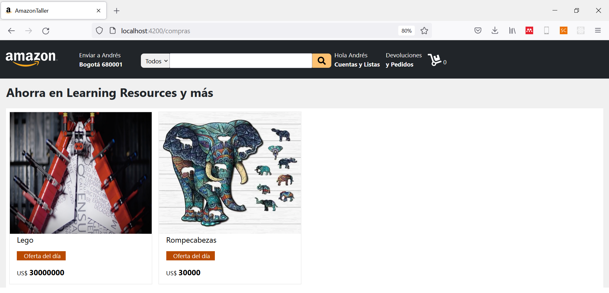
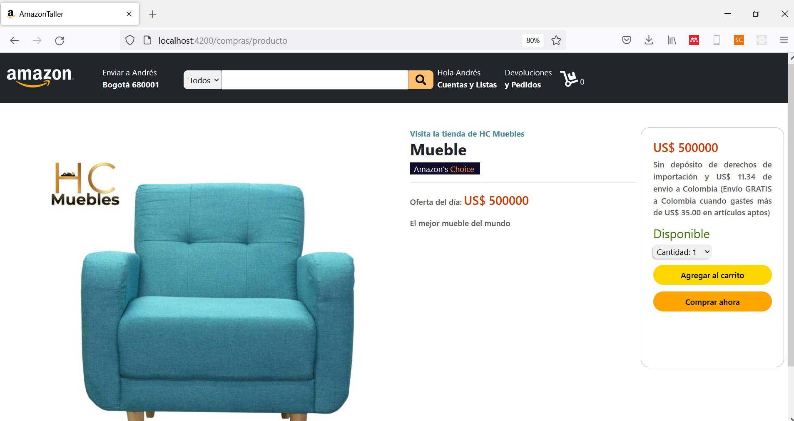

<div align="center">
    <h1>Taller 2</h1>
</div>

## Introducción

En el presente taller, continuaremos con nuestro desarrollo frontend de Amazon. Anteriormente, logramos construir la sección de categorías de producto. A continuación, construiremos la sección de productos en donde el usuario podrá seleccionar los artículos específicos que desea adquirir.

## Problema

Nuestro problema objetivo será replicar el desarrollo frontend de Amazon, en la sección de _"Ofertas del día"_, como se aprecia a continuación.



<p align="center"><i>Figura 1.</i> Problema de interés.</p>

Para ello, continuaremos con el desarrollo del taller 1.

## 1. Configuración de rutas

Complementaremos el desarrollo del taller 1 a través de la construcción de distintas páginas (URLs). Para ello, iniciaremos creando el componente de _compras_, ejecutando el siguiente comando en consola: `ng g c compras`. Ahora, especificaremos la ruta para acceder a cualquiera de nuestros componentes: productos o compras.

### 1.1. app-routing.module.ts

Este archivo permite la configuración de las rutas de nuestro proyecto. Originalmente, tiene la siguiente estructura:

```TS
import { NgModule } from '@angular/core';
import { Routes, RouterModule } from '@angular/router';


const routes: Routes = [];

@NgModule({
  imports: [RouterModule.forRoot(routes)],
  exports: [RouterModule]
})
export class AppRoutingModule { }
```

En la variable `routes` es donde especificaremos nuestras direcciones. Para ello, iniciamos importando los componentes con los que deseamos trabajar:

```TS
import { ProductosComponent } from './productos/productos.component';
import { ComprasComponent } from './compras/compras.component';
```

Luego, las añadimos a la variable routes, de la siguiente forma:

```TS
const routes: Routes = [
  {path: '', component: ProductosComponent},
  {path: 'compras', component: ComprasComponent}
];
```
La primera línea corresponde a la vista principal de nuestro desarrollo, correspondiente al resultado del primer taller. La segunda hace referencia a parte del desarrollo del presente taller. La dirección `compras` hace referencia a la sección de compras.

Nuestro archivo  quedará de la siguiente forma:

```TS
import { NgModule } from '@angular/core';
import { Routes, RouterModule } from '@angular/router';
import { ProductosComponent } from './productos/productos.component';
import { ComprasComponent } from './compras/compras.component';

const routes: Routes = [
  {path: '', component: ProductosComponent},
  {path: 'compras', component: ComprasComponent}
];

@NgModule({
  imports: [RouterModule.forRoot(routes)],
  exports: [RouterModule]
})
export class AppRoutingModule { }
```

Si deseas mayor información, puedes acceder a la documentación oficial de Angular a través del siguiente [enlace](https://angular.io/tutorial/toh-pt5).

### 1.2. app.component.html

Haremos un ajuste de funcionalidad a la cabecera de nuestro desarrollo, que encontramos en __Amazon/src/app/app.component.html__. La idea es que cuando el usuario haga click en el logo de Amazon, lo dirija al desarrollo del primer taller.

Para ello, emplearemos el argumento de Angular de etiqueta `routerLink`, de la siguiente forma:

```HTML
  <a class="navbar-brand" routerLink="/" routerLinkActive="active"></a>
```
Como puedes observar, sólo es agregarle a la etiqueta del logo de amazon (que contiene la clase `navbar-brand`) la extensión del routerLink. 

Ahora, añadiremos las direcciones de nuestro proyecto al final de la presente sección, simplemente añadiendo la siguiente etiqueta:

```HTML
...
<router-outlet></router-outlet>
```

Este ajuste nos permitirá usar las rutas registradas anteriormente.

### 1.3. productos.component.html

Haremos un ajuste en este documento, de tal forma que cuando el usuario desee acceder a una categoría de compra, lo redirija a los artículos de dicha categoría. Para ello, agregaremos el router correspondiente. Originalmente, la sección de categorías de productos estaba construida de la siguiente forma:

```HTML
<div class="categorias-productos grid">
    <div class="categoria-producto" *ngFor="let categoria of categoriasProductos | keyvalue">
        
        <div class="cont-promo">
            <p class="promocion">Black Friday</p>
            <p class="precios">{{categoria.value.get('precios')}}</p>
            <p style="margin-top: -1rem; font-size: 18px;">Ahorra en {{categoria.key}} y más</p>
        </div>
    </div>
</div>
```

Simplemente la reajustaremos para que quede así:

```HTML
<div class="categorias-productos grid">
    <a class="categoria-producto" *ngFor="let categoria of categoriasProductos | keyvalue" routerLink="/compras" routerLinkActive="active">
        
        <div class="cont-promo">
            <p class="promocion">Black Friday</p>
            <p class="precios">{{categoria.value.get('precios')}}</p>
            <p style="margin-top: -1rem; font-size: 18px;">Ahorra en {{categoria.key}} y más</p>
        </div>
    </a>
</div>
```

Ahora, al hacer click sobre alguna de las categorías, nos entrará al archivo `compras.component.html`. Por ejemplo:



Fíjate en el resultado de la URL. ¡Corresponde a la sección de compras! Y si haces click sobre el logo de Amazon, volverás al resultado del primer taller.

En este punto, las rutas genéricas iniciales del proyecto ya están listas. 

## 2. Componente de compras

En nuestro componente de _compras_, mostraremos al usuario los artículos correspondientes a la categoría escogida. Si bien, en un desarrollo completo, la información de los productos y categorías se obtienen del desarrollo backend a través de API's, a modo de ilustración y de aprendizaje, obtendremos la información a través un diccionario (mapa) creado manualmente que se conectará con un directorio de carpetas, que contendrá las imágenes de nuestros productos, como se aprecia a continuación:

```
categorias   
└───Flash Furniture
|         general.jpg
|               └───productos
|               |       mueble.jpg
|               |       mesa.png
└───Greenworks
|               └───productos
|               |       cortacesped.jpg
|               |       tractor.webp
└───Learning Resources
|               |       rompe.webp
|               |       lego.png

```

Esta carpeta de _categorias_ la debes ubicar dentro de la carpeta __assets__ y la puedes descargar a través del siguiente [enlace](https://1drv.ms/u/s!ApXJVEmB0N31ky55SG7pUdAu5Hg9?e=56JE3C).

### 2.1. productos.component.ts

Lo primero que haremos será añadir la información de los productos individuales en nuestro diccionario `categoriaProductos`; por lo que ahora será:

```TS
categoriasProductos:Map<string, Map<string, any>> = new Map<string, Map<string, any>>([
  ["Flash Furniture", new Map<string, any>([
    ["precios", "$10.72 - $856.00"],
    ["img", "../assets/categorias/Flash Furniture/general.jpg"],
    ["productos", new Map<string, any>([
      ["Mesa", new Map<string, any>([
        ["imagen", "../assets/categorias/Flash Furniture/mesa.png"],
        ["precio", 300000],
        ["descripcion", "La mejor mesa del mundo"],
        ["marca", "HC Muebles"]
      ])],
      ["Mueble", new Map<string, any>([
        ["imagen", "../assets/categorias/Flash Furniture/mueble.jpg"],
        ["precio", 500000],
        ["descripcion", "El mejor mueble del mundo"],
        ["marca", "HC Muebles"]
      ])]
    ])]
  ])],
  ["Greenworks", new Map<string, any>([
    ["precios", "$10.72 - $856.00"],
    ["img", "../assets/categorias/Greenworks/general.jpg"],
    ["productos", new Map<string, any>([
      ["Corta cesped", new Map<string, any>([
        ["imagen", "../assets/categorias/Greenworks/cortacesped.jpg"],
        ["precio", 300000],
        ["descripcion", "La mejor mesa del mundo"],
        ["marca", "HC Muebles"]
      ])],
      ["Tractor", new Map<string, any>([
        ["imagen", "../assets/categorias/Greenworks/tractor.webp"],
        ["precio", 30000000],
        ["descripcion", "El mejor tractor del mundo"],
        ["marca", "HC Muebles"]
      ])]
    ])]
  ])],
  ["Learning Resources", new Map<string, any>([
    ["precios", "$10.72 - $856.00"],
    ["img", "../assets/categorias/Learning Resources/general.jpg"],
    ["productos", new Map<string, any>([
      ["Lego", new Map<string, any>([
        ["imagen", "../assets/categorias/Learning Resources/lego.png"],
        ["precio", 30000000],
        ["descripcion", "El mejor lego del mundo"],
        ["marca", "Lego"]
      ])],
      ["Rompecabezas", new Map<string, any>([
        ["imagen", "../assets/categorias/Learning Resources/rompe.webp"],
        ["precio", 30000],
        ["descripcion", "El mejor rompecabezas del mundo"],
        ["marca", "Lego"]
      ])]
    ])]
  ])]
]);
```

Lo siguiente que debemos es hacer es _almacenar_ la información de nuestra base de datos en el navegador de nuestros usuarios para optimizar el rendimiento de respuesta de nuestro servicio (en lugar de solicitar, una y otra vez, la información al servidor), y lo haremos de la siguiente forma:

```TS
ngOnInit(): void {
  this.usuario = localStorage.getItem("usuario") || '{}';
  this.opcionesFiltrado = JSON.parse(localStorage.getItem("opciones") || '[]');
}

compras(categoria:string):void {
  //Filtrado de información
  const categoriaInfo:Map<string, any> = this.categoriasProductos.get(categoria) || new Map<string, any>();
  const productos:Map<string, any> = categoriaInfo.get("productos");

  //Guardado de información
  localStorage.setItem("productos", JSON.stringify(productos, this.reemplazar));

  //Cambio de página
  this.router.navigate(['compras']);
}

reemplazar(key:string, value:any): any {
  if (value instanceof Map) {
    return Array.from(value);
  }
  return value;
}
```

Como puedes observar, construimos dos funciones adicionales:

* __compras:__ recibe como argumento el nombre de la categoría. Esto lo usaremos para filtrar la información de los productos de la categoría escogida por nuestros usuarios para, cuando llegue a la página de compras, obtenga el resultado que desea.
* __reemplazar:__ se emplea para labores de ajuste de nuestro diccionario (mapa) para guardarlo en el navegador de nuestros usuarios.


### 2.3. productos.component.html

Anteriormente, hicimos un ajuste en el documento para permitir el cambio de página. Sin embargo, no queremos sólo _"cambiar la página"_, sino que, antes de ello, almacenar la información de los productos (función de compras en la sección 2.2). Por lo tanto, haremos un ajuste que permita que cuando el usuario haga click sobre la categoría nos ejecute la función compras.

```HTML


<div class="contenido-categorias">
    <div class="categorias-genericas">
        <p><b>Departamentos</b></p>
        <div class="categoria" *ngFor="let opcion of opcionesFiltrado;">
            <p><input type="checkbox"> {{opcion}}</p>
        </div>
    </div>
    <div class="categorias-productos grid">
        <a class="categoria-producto" *ngFor="let categoria of categoriasProductos | keyvalue" (click)= "compras(categoria.key)">
            
            <div class="cont-promo">
                <p class="promocion">Black Friday</p>
                <p class="precios">{{categoria.value.get('precios')}}</p>
                <p style="margin-top: -1rem; font-size: 18px;">Ahorra en {{categoria.key}} y más</p>
            </div>
        </a>
    </div>
</div>
```

### 2.4. compras.component.ts

Ahora, construiremos la lógica de nuestro desarrollo. Lo primero que debemos hacer es importar la información de nuestros productos:

```TS
productos:Map<string, Map<string, any>> = new Map<string, Map<string, any>>();

constructor() { }

ngOnInit(): void {
  //Lectura de información general y transformación de datos
  var infoProductos:Array<any> = JSON.parse(localStorage.getItem("productos") || '[]', this.convertidor || '[]');

  infoProductos = Object.values(infoProductos);
  this.productos = this.traductor(infoProductos);
}

convertidor(key:string, value:any) {
  //Convierte el contenido en un objeto
  if (typeof value === 'object' && value !== null) {
    if (value.dataType === 'Map') {
      return new Map<string, any>(value.value);
    }
  }
  return value
}

traductor(productos:Array<any>): Map<string, Map<string, any>> {
  console.log(productos);
  var res:Map<string, Map<string, any>> = new Map<string, Map<string, any>>();
  for (let producto of productos) {
      res.set(producto[0], new Map<string, any>([
        ["imagen", producto[1][0][1]],
        ["precio", producto[1][1][1]],
        ["descripcion", producto[1][2][1]],
        ["marca", producto[1][3][1]]
      ]))
  }
  return res;
}
```

Nuevamente, tenemos dos funciones adicionales:

* __convertidor:__ se emplea para convertir la información obtenida de los productos en un array legible por el sistema.

* __traductor:__ convierte el array obtenido en un diccionario para facilitar el procesamiento de la información.

### 2.5. compras.component.html

Ahora, teniendo la inforamción, construiremos la organización de nuestro desarrollo.

```HTML
<div class="cuerpo">
    <h2>Ahorra en {{categoria}} y más</h2>

    <div class="productos grid">
        <div class="producto" *ngFor="let prod of productos | keyvalue">
            <a href="">
                
                <p style="font-size: 20px;">{{prod.key}}</p>
                <p class="promocion">Oferta del día</p>
                <p>US$ <b>{{prod.value.get("precio")}}</b></p>
            </a>
        </div>
    </div>
</div>
```

### 2.6. compras.component.css

Aplicando los estilos a nuestro documento...

```CSS
.cuerpo {
    background-color: rgb(240, 240, 240);
}

h2 {
    padding: 1rem;
    font-weight: bold;
}

.productos {
    margin-left: 1%;
    margin-right: 1%;
    background-color: white;
}

.producto {
    border: solid rgb(240, 240, 240);
    border-width: 0.15rem;
    margin: 0.5rem;
}

.producto img {
    width: 100%;
    height: 20rem;
}

.producto a {
    text-decoration: none;
    color: black;
    font-size: 16px;
}

.producto p {
    padding-left: 5%;
}

.producto b {
    font-size: 20px;
}

.grid {
    display: grid;
    grid-template-columns: 1fr 1fr 1fr 1fr;
}

.promocion {
    background-color: rgb(185, 74, 0);
    color: white;
    width: 8rem;
    margin-left: 5%;
    padding-left: -2rem;
}
```

Obtendremos el siguiente resultado:



## 3. Página de producto

Ahora, el usuario tendrá la posibilidad de escoger __un__ sólo producto para observar su información.

Lo primero que haremos será crear la aplicación `producto` ejecutando en consola: `ng g c producto`

### 3.1. app-routing.module.ts

Añadiremos una nueva ruta a nuestro desarrollo, que corresponderá a la página de información del producto.

```TS
import { ProductoComponent } from './producto/producto.component';

const routes: Routes = [
  {path: '', component: ProductosComponent},
  {path: 'compras', component: ComprasComponent},
  {path: 'compras/producto', component: ProductoComponent}
];
```

### 3.2. compras.component.ts

Crearemos una función que permita: 
 
1. Almacenar la información del producto que se desea observar.
2. Cambiar a la página del producto.

```TS
producto(prod:string):void {
  //Filtrar la información del producto
  var producto:Map<string, any> = this.productos.get(prod) || new Map<string, any>();
  producto.set("nombre", prod);

  //Almacenar información
  localStorage.setItem("producto", JSON.stringify(producto, this.reemplazar));

  //Cambio de página
  this.router.navigate(['compras', 'producto']);
}

reemplazar (key:string, value:any): any {
  if (value instanceof Map) {
    return Array.from(value);
  }
  return value;
}
```

La función `reemplazar` permite acomodar el mapa para convertirlo en texto y almacenar su contenido en el navegador del usuario.

### 3.3. compras.component.html

Ahora, haremos que, cuando el usuario haga click sobre un producto de interés, active la función que creamos en la sección 3.2.

```HTML
<a (click) ="producto(prod.key)">
    
    <p style="font-size: 20px;">{{prod.key}}</p>
    <p class="promocion">Oferta del día</p>
    <p>US$ <b>{{prod.value.get("precio")}}</b></p>
</a>
```

Este efecto lo logramos gracias al argumento `(click)`.

### 3.4. producto.component.ts

En el componente producto importaremos la información del producto que el usuario desea adquirir y luego la convertiremos en un mapa para utilizarla fácilmente en el documento HTML de nuestro componente.

```TS
producto:Map<string, any> = new Map<string, any>();

constructor() { }

ngOnInit(): void {
  //Leer información
  const info:Array<any> = JSON.parse(localStorage.getItem("producto") || "[]");

  //Convertir a mapa
  for (let arg of info) {
    this.producto.set(arg[0], arg[1]);
  }
}
```

### 3.5. producto.component.html

Para nuestro desarrollo, aplicaremos la siguiente organización:

```HTML
<div class="grid">
    
    <div class="contenido">
        <div class="descripcion">
            <a>Visita la tienda de {{producto.get("marca")}}</a>
            <h1>{{producto.get("nombre")}}</h1>
            <p class="promocion">Amazon's <a>Choice</a></p>
            <hr>
            <div class="info">
                <p>Oferta del día: <a>US$ {{producto.get("precio")}}</a></p>
                <p>{{producto.get("descripcion")}}</p>
            </div>
        </div>
        <div class="compra">
            <h1>US$ {{producto.get("precio")}}</h1>
            <p>Sin depósito de derechos de importación y US$ 11.34 de envío a Colombia (Envío GRATIS a Colombia cuando gastes más de US$ 35.00 en artículos aptos) </p>
            <h2>Disponible</h2>
            <select>
                <option value="1">Cantidad: 1</option>
                <option value="2">Cantidad: 2</option>
                <option value="3">Cantidad: 3</option>
            </select>
            <button style="background-color: gold;">Agregar al carrito</button>
            <button style="background-color: orange;">Comprar ahora</button>
        </div>
    </div>
</div>
```

### 3.6. producto.component.css

Finalmente, aplicaremos los estilos necesarios:

```CSS
img {
    width: 90%;
    margin-left: 2%;
    margin-top: 2%;
}

.contenido {
    position: 50%;
    display: grid;
    grid-template-columns: 60% 40%;
    margin-left: 0.5rem;
}

.grid {
    display: grid;
    grid-template-columns: 1fr 1fr;
    margin-top: 3rem;
    margin-left: 3rem;
}

.descripcion a {
    text-decoration: none;
    color: rgb(71, 138, 150);
    font-weight: bold;
}

.descripcion a:hover {
    text-decoration: underline;
    color: orange;
}

.descripcion h1 {
    font-weight: bold;
    font-size: 32px;
}

.promocion {
    background-color: rgb(15, 12, 44);
    color: white;
    width: 8.8rem;
    padding-left: 0.5rem;
    padding-right: 0.5rem;
}

.promocion a {
    color: rgb(255, 153, 0);
    font-weight:normal;
}


.info {
    color: rgb(90, 90, 90);
    font-weight: 600;
}

.info a {
    color: rgb(202, 57, 0);
    font-size: 24px;
    font-weight: 600;
}

.descripcion hr {
    background-color: rgb(140, 140, 140);
}

.compra {
    margin-left: 0.5rem;
    margin-right: 0.5rem;
    border: solid rgb(190, 190, 190);
    border-radius: 1rem;
    border-width: 0.1rem;
    height: 30rem;

    padding: 1.5rem;
    color: rgb(90, 90, 90);
    font-weight: 600;
    text-align: justify;
}

.compra h1 {
    color: rgb(202, 57, 0);
    font-size: 24px;
    font-weight: 600;
}

.compra h2 {
    color: rgb(69, 104, 17);
    font-size: 24px;
}

.compra select {
    background-color: rgb(240, 240, 240);
    border: none;
    border-radius: 0.5rem;
    font-weight: 500;
    padding: 0.2rem 0.5rem 0.2rem 0.2rem;
    box-shadow: -0.15rem 0.15rem 0.1rem rgb(200, 200, 200);
}

.compra select:hover {
    background-color: rgb(190, 190, 190);
}

button {
    width: 100%;
    margin-top: 0.8rem;
    border: none;
    border-radius: 2rem;
    padding: 0.5rem;

    font-weight: 600;
}
```

Obteniendo el siguiente resultado:


