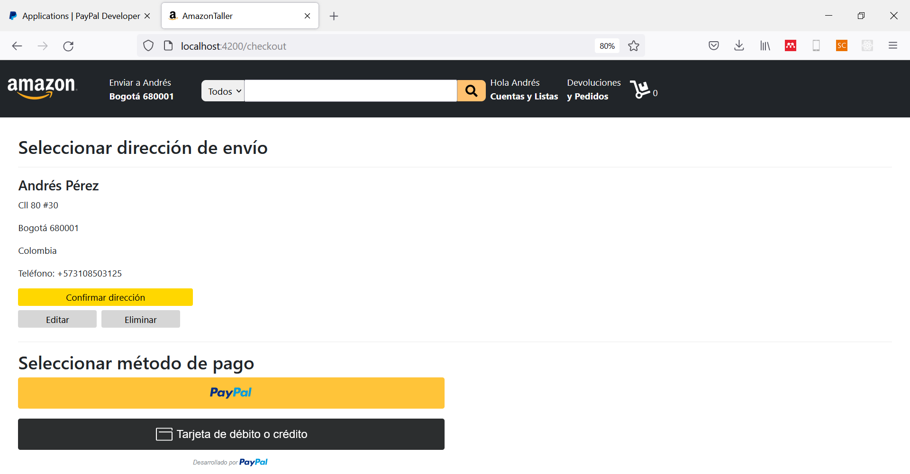

<div align="center">
    <h1>Taller 3</h1>
</div>

## Introducción

Para finalizar con nuestro desarrollo, construiremos las secciones de _carrito_ y _checkout_ que permitirá la compra de los artículos a través de una cuenta PayPal. Las adiciones que haremos con respecto al taller anterior serán:

1. Resumen del total de artículos contenidos en el carrito de compras.


<p align="center"><i>Figura 1.</i> Resumen de artículos de compra en <b>todas</b> las páginas.</p>

2. Página del carrito, donde el usuario podrá eliminar o seleccionar cantidades de artículos.


<p align="center"><i>Figura 2.</i> Sección de carrito de compras.</p>

3. Proceder al pago de los artículos en la sección del checkout.


<p align="center"><i>Figura 3.</i> Sección de checkout.</p>

## 1. Resumen del carrito

El resumen del carrito busca simplificar las compras del usuario, mostrándole, a través de imágenes, los artículos que está adquiriendo y el valor total de su compra, como se aprecia en la Figura 1.

Como deseamos que el resumen se presente en todas las vistas de nuestro desarrollo, deberemos incluirlo en la __aplicación principal__ y realizar algunos ajustes en otros componentes.

### 1.1. app.component.ts

Empezaremos por crear la variable en donde almacenaremos nuestros productos y el valor total que tendrán. Para ello, crearemos la variable `articulos`, como atributo de la clase `AppComponent`, que será el array en donde almacenaremos la información referente a los artículos de nuestros usuarios.

```TS
articulos:Array<any> = [];
total:number = 0;
```

### 1.2. producto.component.ts

Ahora que tenemos la variable en dónde almacenar nuestros artículos, crearemos la función que permita añadir los artículos, actualizar el número y recalcular el total de compra. Lo primero que debemos hacer es importar la variable `articulos` de la siguiente forma:

```TS
import { AppComponent } from '../app.component';

...

constructor(private router:Router, private app:AppComponent) { }
```

Como puedes apreciar, importamos el `Router` de Angular para permitir el cambio entre páginas e importamos el `AppComponent` para actualizar los atributos de la clase y, con ello, que se actualice la inforamción de forma automática.

Para reconocer la cantidad de artículos a adquirir, seleccionados por el usuario, debemos hacer un pequeño cambio. Primero, crearemos un nuevo atributo de la clase:

```TS
cantidad:number = 1;
```

Lo siguiente que debemos hacer es crear una función que nos reconozca el _evento_ de cambio de cantidad:

```TS
valorCantidad(event:any): void {
    this.cantidad = parseInt(event.target.value);
}
```

---

__Programación orientada a eventos:__

Un evento se conoce como la ocurrencia de _"un cambio"_. En este caso particular, queremos hacer seguimiento de un cambio de selección de cantidad.

---

Ahora que tenemos cómo actualizar la cantidad de artículos, crearemos la función `vistaPrincipal` de la siguiente forma:

```TS
vistaPrincipal() {
    //Cantidad del artículo
    this.producto.set("cantidad", this.cantidad);

    //Añadimos el artículo y actualizamos número de artículos y total
    this.app.articulos.push(this.producto);
    this.app.numArt = this.app.numArt +  this.cantidad;
    this.app.total += this.cantidad*this.producto.get("precio");

    //Cambio de página
    this.router.navigate(["/"]);
  }
```

### 1.3. producto.component.html

Ahora, añadimos la funcionalidad de la función `vistaPrincipal` al hacer click sobre el botón __"Agregar al carrito"__ de la siguiente forma.

```HTML
<button style="background-color: gold;" (click)="vistaPrincipal()">Agregar al carrito</button>
```

Adicional, añadiremos la función que permite actualizar el valor de la cantidad:

```HTML
<select  (change) = "valorCantidad($event)">
```

### 1.4. app.component.html

Adaptaremos la vista del navegador de nuestro de desarrollo para que, además, muestre el resumen de compras siempre y cuando la cantidad de artículos adquiridos sea mayor que cero, además de brindar un estilo tipo _malla_ que permita categorizar la pantalla. El documento HTML quedará de la siguiente forma:

```HTML
<div class="malla" [class.malla] = "numArt > 0">
  <div>
    <nav class="navbar navbar-expand-lg navbar-dark bg-dark">
      <a class="navbar-brand" routerLink="/" routerLinkActive="active"></a>
      <button class="navbar-toggler" type="button" data-toggle="collapse" data-target="#navbarSupportedContent" aria-controls="navbarSupportedContent" aria-expanded="false" aria-label="Toggle navigation">
        <span class="navbar-toggler-icon"></span>
      </button>

      <div class="collapse navbar-collapse" id="navbarSupportedContent">
        <ul class="navbar-nav mr-auto">
          <li class="nav-item">
            <a class="nav-link" href="#">
              Enviar a {{usuario}}
              <br>
              <b>{{lugar}} {{zip}}</b>
            </a>
          </li>
          <form class="form-inline menu-busqueda">
            <select>
              <option *ngFor="let tipo of categorias;" value="{{tipo}}">{{tipo}}</option>
            </select>
            <input class="" type="search" aria-label="Search">
            <button class="" type="submit"><fa-icon [icon]="iconoBusqueda" class="fa-lg"></fa-icon></button>
          </form>
          <li class="nav-item">
            <a class="nav-link" href="#">
              Hola {{usuario}}
              <br>
              <b>Cuentas y Listas</b>
            </a>
          </li>
          <li class="nav-item">
            <a class="nav-link" href="#">
              Devoluciones
              <br>
              <b>y Pedidos</b>
            </a>
          </li>
          <li class="nav-item active">
            <a class="nav-link" href="#"><fa-icon [icon]="iconoCarrito" class="fa-2x"></fa-icon> {{numArt}}</a>
          </li>
        </ul>
      </div>
    </nav>
    <router-outlet></router-outlet>
  </div>

  <div *ngIf="numArt > 0" class="resumen-carrito">
    <p>Subtotal</p>
    <h2>US$ {{total}}</h2>
    
  </div>

</div>
```

---

__Clases dinámicas:__

```HTML
<div class="malla" [class.malla] = "numArt > 0">
```

Podemos especificar las clases dinámicas en Angular. En este caso particular, especificamos que adopte un comportamiento de malla si el número de artículos es superior a cero. La sintaxis seguida es: `[class.<nombre_clase>] = "condición"`.

__Condicionales:__

```HTML
<div *ngIf="numArt > 0" class="resumen-carrito">
```

Especificamos una sección condicional a través del operador `ngIf`. El contenido se mostrará siempre que se cumpla la condición.

---

### 1.5. app.component.css

Ahora, aportaremos los estilos de nuestra actualización:

```CSS
.navbar-brand {
    background-image: url("../assets/wlogo.png");
    width: 9rem;
    padding-bottom: 5rem;
    margin-right: 2.5rem;
    background-size: 100% 100%;
}

.navbar a {
    /* Color de letra para las etiquetas <a></a> que se que pertenezcan al div que contenga la clase navbar */
    color:white;
}

.menu-busqueda {
    width: 500px;
    margin-top: 1rem;
    margin-left: 2.5rem;
}

.menu-busqueda select {
    /* Contiene las opciones de categorías */
    width:15%;
    padding: 0.5rem;
    background-color: rgb(240, 240, 240);
    border: none;
    border-radius: 0.5rem 0 0 0.5rem;
}

.menu-busqueda input {
    /* Zona en donde se escribe la búsqueda */
    width: 75%;
    padding-top: 0.35rem;
    padding-bottom: 0.35rem;
}

.menu-busqueda button {
    /* Botón de búsqueda */
    width: 10%;
    background-color: rgb(255, 193, 112);
    border: none;
    border-radius: 0 0.5rem 0.5rem 0;
    padding-top: 0.4rem;
    padding-bottom: 0.4rem;
}

.resumen-carrito {
    background-color: white;
    margin-top: 5%;
    margin-left: 5%;
    text-align: center;
    font-size: 14px;
}

.resumen-carrito h2 {
    color:rgb(160, 7, 7);
    font-size: 18px;
    margin-top: -0.5rem;
}

.resumen-carrito img {
    width: 90%;
}

.malla {
    display: grid;
    grid-template-columns: 90% 10%;
}

@media screen and (max-width:600px) {
    .malla {
        grid-template-columns: 100% 0%;
    }
}
```

Obteniendo el siguiente resultado cuando se realiza una compra:


## 2. Componente carrito

Ahora, construiremos la sección del carrito de compras (Figura 2), en donde el usuario podrá apreciar el resumen de las compras y decidir si desea añadir nuevos artículos o eliminarlos.

Iniciamos creando el nuevo componente de la siguiente forma: `ng g c carrito`

### 2.1. app-routing.module.ts

Iniciaremos añadiendo la ruta del carrito de compras de la siguiente forma:

```TS
import { CarritoComponent } from './carrito/carrito.component';

const routes: Routes = [
  ...,
  {path: 'carrito', component:CarritoComponent}
];
```

### 2.2. app.component.ts

Para evaluar la página en la que nos encontramos, simplemente importaremos la clase `Router` y la añadiremos al constructor de la clase `AppComponent` de la siguiente forma:

```TS
import { Router } from '@angular/router';

...

constructor(public route:Router) { }
```

Hacemos la importación de tipo `public` para que podamos acceder al router desde el documento HTML.

### 2.2. app.component.html

Lo siguiente que haremos será habilitar la dirección del carrito cuando el usuario haga click sobre la imagen del carrito.

```HTML
<a class="nav-link" routerLink="/carrito" routerLinkActive="active"><fa-icon [icon]="iconoCarrito" class="fa-2x"></fa-icon> {{numArt}}</a>
```

Al hacer click sobre la imagen carrito, obtendremos el siguiente resultado:


Como deseamos que el resumen de compras no nos aparezca en la sección del carrito, modificaremos la condición de la clase de la siguiente forma:

```HTML
<div class="malla" [class.malla] = "numArt > 0 && route.routerState.snapshot.url !== '/carrito' ">
```

También, modificaremos la condición de la sección:

```HTML
<div *ngIf="numArt > 0 && route.routerState.snapshot.url !== '/carrito'" class="resumen-carrito">
```

### 2.3. app.module.ts

Para el uso de formularios en Angular, deberemos agregar la siguiente configuración:

```TS
import {FormsModule, ReactiveFormsModule} from "@angular/forms";

@NgModule({
  imports: [
    ...,
    FormsModule,
    ReactiveFormsModule,
  ]
```


### 2.3. carrito.component.ts

Ahora, añadiremos las funciones que permitan: añadir nuevos artículos o eliminarlos. Empezamos importando los artículos de la siguiente forma:

```TS
import { AppComponent } from '../app.component';

constructor(public app:AppComponent) { }
```

Añadimos la aplicación principal como pública para poder utilizarla dentro del documento HTML.

Ahora, crearemos las funciones `actualizarItem` y `eliminarItem`.

* __actualizarItem__:__ actualiza el número de items de un artículo en específico .

* __eliminarItem:__ elimina un artículo.

```TS
actualizarItem(art:Map<string, any>, form:NgForm):void {
  //Leer entrada numérica
  const cant:number = form.value.cantidad;

  //Desarrollo
  if (cant <= 0) {
    //Eliminamos el artículo de la lista
    this.eliminarItem(art);
  } else {
    //Adicionamos la cantidad del artículo y actualizamos
    this.eliminarItem(art, false);
    const indice = this.app.articulos.indexOf(art);
    this.app.articulos[indice].set("cantidad", cant);
    this.app.numArt += cant;

    const precio = art.get("precio");
    this.app.total += precio*cant;
  }    

}

eliminarItem(art:Map<string, any>, del:boolean = true):void {
  const indice = this.app.articulos.indexOf(art);
  //Actualizar número de artículos
  const numArtAnterior:number = this.app.articulos[indice].get("cantidad");
  this.app.numArt -= numArtAnterior;

  //Actualizar total
  const precio = art.get("precio");
  this.app.total -= precio*numArtAnterior;

  //Eliminar artículo
  if (del) {
    this.app.articulos.splice(indice, 1);
  }
}
```

### 2.4. carrito.component.html

El documento HTML que construiremos consistirá en lo siguiente:

```HTML
<div class="carrito">
    <div *ngIf="app.articulos.length === 0">
        <h1>Aún no has seleccionado ningún artículo</h1>
    </div>
    <div *ngIf="app.articulos.length > 0">
        <div *ngFor="let art of app.articulos;" class="articulo">
            <div>
                
            </div>
            <form class="contenido" (ngSubmit) = "actualizarItem(art, form)" #form = "ngForm">
                <h1>{{art.get('nombre')}}</h1>
                <p class="precio">US${{art.get('precio')}}</p>
                <p class="promo">#1 el más vendido</p>
                <p><input name="cantidad" type="number" ngModel> <button type="submit">Actualizar</button> <b>| </b> <a (click)="eliminarItem(art)">Eliminar</a></p>
            </form>
        </div>
    </div>
    <div class="checkout">
        <p class="envio">Tu pedido es elegible para <b>envío GRATIS</b>.</p>
        <h2>Subtotal ({{app.numArt}} productos): US${{app.total}}</h2>
        <p><input type="checkbox" ngModel> Este pedido es un regalo</p>
        <button>Proceder al pago</button>
    </div>
</div>
```

### 2.5. carrito.component.css

Aplicamos los siguientes estilos:

```CSS
.carrito {
    background-color: rgb(240, 240, 240);
    display: grid;
    grid-template-columns: 75% 25%;
    padding: 2rem;
}

.articulo {
    margin-bottom: 1rem;
    padding-bottom: 1rem;
    background-color: white;
    border: none;
    width: 90%;
    padding-left: 1rem;
    padding-top:1rem;

    display: grid;
    grid-template-columns: 30% 70%;
}

.articulo img {
    width: 100%;
}

.contenido {
    padding-left: 1rem;
}

.contenido h1 {
    font-size: 32px;
}

.precio {
    font-weight:800;
    font-size:1.5rem;
}

.promo {
    background-color: rgb(221, 113, 50);
    color: white;
    border-radius: 0.2rem;
    width: 9.5rem;
    padding: 0.5rem;
}

.checkout {
    background-color: white;
    padding: 2rem;
    height: 16rem;
}

.envio {
    color: rgb(23, 133, 47);
}

.checkout p b {
    font-weight: bold;
}

.checkout h2 {
    font-size: 24px;
    font-weight: bold;
}

.checkout button {
    width: 100%;
    border: none;
    border-radius: 0.5rem;
    padding-top:0.5rem;
    padding-bottom: 0.5rem;
    background-color: gold;
}

.checkout button:hover {
    background-color: rgb(236, 201, 1);
}

.contenido input {
    width: 20%;
    padding-top: 0.2rem;
    padding-bottom: 0.2rem;
}

.contenido button {
    width: 12%;
    background-color: gold;
    border: none;
    border-radius: 0.5rem;
    margin-left: 0.5rem;
}

.contenido a {
    color: rgb(1, 151, 151);
}

.contenido b {
    margin-left:0.5rem;
    margin-right: 0.5rem;
    font-weight: 300;
    color: rgb(201, 201, 201);
}
```

Obteniendo el siguiente resultado:


## 3. Checkout

En la sección de checkout construiremos el formulario de la información base de envío y estableceremos como medio de pago PayPal. Empezamos creando el componente de checkout con el comando `ng g c checkout`

### 3.1. app-routing.module.ts

Iniciamos creando la ruta de nuestro nuevo componente:

```TS
import { CheckoutComponent } from './checkout/checkout.component';

const routes: Routes = [
  ...,
  {path: 'checkout', component:CheckoutComponent}
];
```

### 3.2. carrito.component.ts

Construiremos una función que evalúe si se cumple las condiciones para avanzar a la sección del checkout.

```TS
import { Router } from '@angular/router';

constructor(public app:AppComponent, private router:Router) { }

checkout() {
  if (this.app.numArt > 0) {
    this.router.navigate(["checkout"]);
  }
}
```

### 3.3. carrito.component.html

Ahora, habilitaremos el acceso a la función `checkout` en el momento en que el usuario presione el botón de "Proceder al pago".

```HTML
<div class="checkout">
  ...
  <button (click) = "checkout()">Proceder al pago</button>
</div>
```

Cuando se tengan artículos en el carrito, al presionar el botón, nos llevará a la sección de checkout.


En nuestra sección de checkout no será necesario observar el resumen de compras, por lo que lo deshabilitaremos a continuación.

### 3.4. app.component.html

Añadiremos una condición adicional para evitar que se muestre el resumen de compra en la sección de checkout.

```HTML
<div class="malla" [class.malla] = "numArt > 0 && route.routerState.snapshot.url !== '/carrito' && route.routerState.snapshot.url !== '/checkout' ">

<div *ngIf="numArt > 0 && route.routerState.snapshot.url !== '/carrito' && route.routerState.snapshot.url !== '/checkout'" class="resumen-carrito">
```

### 3.5. checkout.component.ts

Añadiremos la siguiente información y configuraciones que permitirán desarrollar la finalización de la compra de nuestros usuarios. Empezamos añadiendo la información de envío del usuario registrado como atributo de la clase y una variable booleana (true o false) que permita mostrar los botones de edición de dirección de entrega.

```TS
infoEnvio:Map<string, string> = new Map<string, string>([
  ["nombre", "Andrés Pérez"],
  ["direccion", "Cll 80 #30"],
  ["lugar", "Bogotá 680001"],
  ["pais", "Colombia"],
  ["contacto", "Teléfono: +573108503125"]
]);

mostrarEdicion: boolean = true;
```

Crearemos un método que, cuando el usuario confirme la dirección, oculte los botones de edición:

```TS
edicion() {
  this.mostrarEdicion = false;
}
```

### 3.6. checkout.component.html

Ahora, brindaremos la forma de nuestro documento HTML.

```HTML
<div class="checkout">
    <h1>Seleccionar dirección de envío</h1>

    <hr>

    <div class="info">
        <h2>{{infoEnvio.get("nombre")}}</h2>
        <p>{{infoEnvio.get("direccion")}}</p>
        <p>{{infoEnvio.get("lugar")}}</p>
        <p>{{infoEnvio.get("pais")}}</p>
        <p>{{infoEnvio.get("contacto")}}</p>
        <button (click) = "edicion()">Confirmar dirección</button>
        <p *ngIf="mostrarEdicion"><button>Editar</button> <button>Eliminar</button></p>
    </div>

    <hr>

    <div class="pago">
        <h1>Seleccionar método de pago</h1>
    </div>
</div>
```

### 3.7. checkout.component.css

Aplicamos los estilos respectivos:

```CSS
.checkout {
    margin-top:2rem;
    margin-left: 2rem;
    background-color: white;
    margin-right: 2rem;
}

.info {
    width: 20%;
}

h1 {
    font-size: 2rem;
    font-weight: 600;
}

h2 {
    font-size: 1.5rem;
    font-weight: 600;
}

button {
    border: none;
    border-radius: 0.2rem;
    padding: 0.2rem;
}

.info button {
    width: 100%;
    background-color: gold;
    margin-bottom: 0.5rem;
}

.info p button {
    width: 45%;
    background-color: rgb(214, 214, 214);
    margin-right: 0.5rem;
}

h3 {
    font-size: 1rem;
    font-weight: 500;
}

hr {
    border: 0.1rem solid rgb(210, 210, 210);
}
```

Lo que nos dará como resultado:


## 4. Configuración de PayPal

Para el establecimiento de la configuración de pago a través de PayPal, vamos a requerir instalar la librería [ngx-paypal](https://www.npmjs.com/package/ngx-paypal) ejecutando el siguiente comando: `npm i ngx-paypal --force`

En __app.module.ts__ añadiremos la librería de la siguiente forma:

```TS
import { NgxPayPalModule } from 'ngx-paypal';

imports: [
  ...,
  NgxPayPalModule
]
```

### 4.1 Cuenta online

Antes de continuar, deberás crear una cuenta de PayPal y acceder a la sección de proyectos a través del siguiente [enlace](https://developer.paypal.com/developer/accounts/).

Una vez creada la cuenta y estando en la sección de proyectos, debes dirigirte a la sección de _"My Apps & Credentials"_, como se muestra a continuación, o a través del siguiente [enlace](https://developer.paypal.com/developer/applications).


En la sección de las credenciales, creamos la aplicación de nuestro taller. 


Finalmente, al crear la app, guardas la información del __Client ID__, que utilizaremos más adelante.


### 4.2 checkout.component.ts

Ahora, brindaremos la funcionalidad para pagos con PayPal. La forma final de nuestro documento TypeScript será la siguiente:

```TS
import { Component, OnInit } from '@angular/core';

import { IPayPalConfig } from 'ngx-paypal';
import { ICreateOrderRequest } from 'ngx-paypal';

import { AppComponent } from '../app.component';

@Component({
  selector: 'app-checkout',
  templateUrl: './checkout.component.html',
  styleUrls: ['./checkout.component.css']
})
export class CheckoutComponent implements OnInit {

  infoEnvio: Map<string, string> = new Map<string, string>([
    ["nombre", "Andrés Pérez"],
    ["direccion", "Cll 80 #30"],
    ["lugar", "Bogotá 680001"],
    ["pais", "Colombia"],
    ["contacto", "Teléfono: +573108503125"]
  ]);

  public payPalConfig?: IPayPalConfig;

  items:any[] = [];

  mostrarEdicion: boolean = true;

  constructor(private app:AppComponent) { }

  ngOnInit(): void {
    this.initConfig();

    //Preparación de items para factura automática:
    for (let art of this.app.articulos) {
      this.items.push({
        name: art.get("nombre"),
          quantity: art.get("cantidad").toString(),
          category: 'DIGITAL_GOODS',
          unit_amount: {
            currency_code: 'USD',
            value: art.get("precio").toString(),
          },
      });
    }
  }

  edicion() {
    this.mostrarEdicion = false;
  }

  private initConfig(): void {
    this.payPalConfig = {
      currency: 'USD',
      clientId: 'id',
      createOrderOnClient: (data) => <ICreateOrderRequest>{
        intent: 'CAPTURE',
        purchase_units: [{
          amount: {
            currency_code: 'USD',
            value: this.app.total.toString(),
            breakdown: {
              item_total: {
                currency_code: 'USD',
                value: this.app.total.toString()
              }
            }
          },
          items: this.items
        }]
      },
      advanced: {
        commit: 'true'
      },
      style: {
        label: 'paypal',
        layout: 'vertical'
      },
      onApprove: (data, actions) => {
        console.log('onApprove - transaction was approved, but not authorized', data, actions);


      },
      onClientAuthorization: (data) => {
        console.log('onClientAuthorization - you should probably inform your server about completed transaction at this point', data);
      },
      onCancel: (data, actions) => {
        console.log('OnCancel', data, actions);

      },
      onError: err => {
        console.log('OnError', err);
      },
      onClick: (data, actions) => {
        console.log('onClick', data, actions);
      },
    };
  }

}
```

En la variable `clientId` deberás reemplazarla por el id obtenido en la sección __4.1__.

### 4.3 checkout.component.html

Finalmente, añadiremos la sección de pagos en nuestro documento HTML:

```HTML
<div class="pago">
    <h1>Seleccionar método de pago</h1>
    <ngx-paypal [config]="payPalConfig"></ngx-paypal>
</div>
```

Obteniendo el siguiente resultado:


