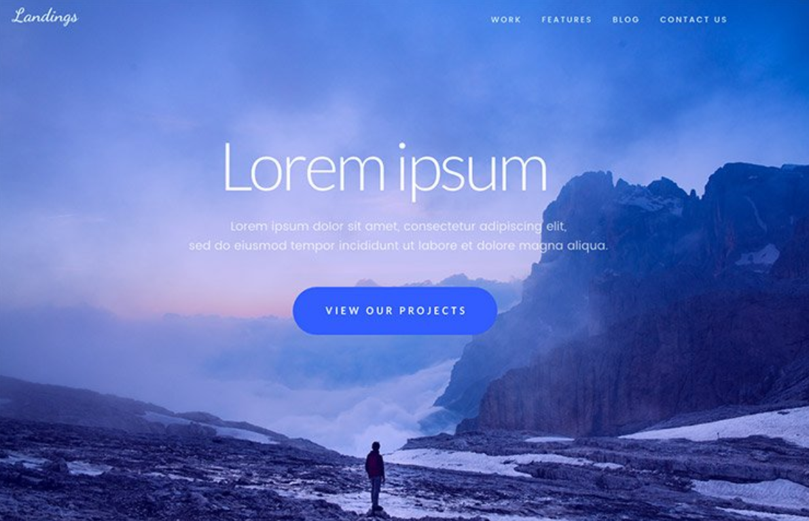
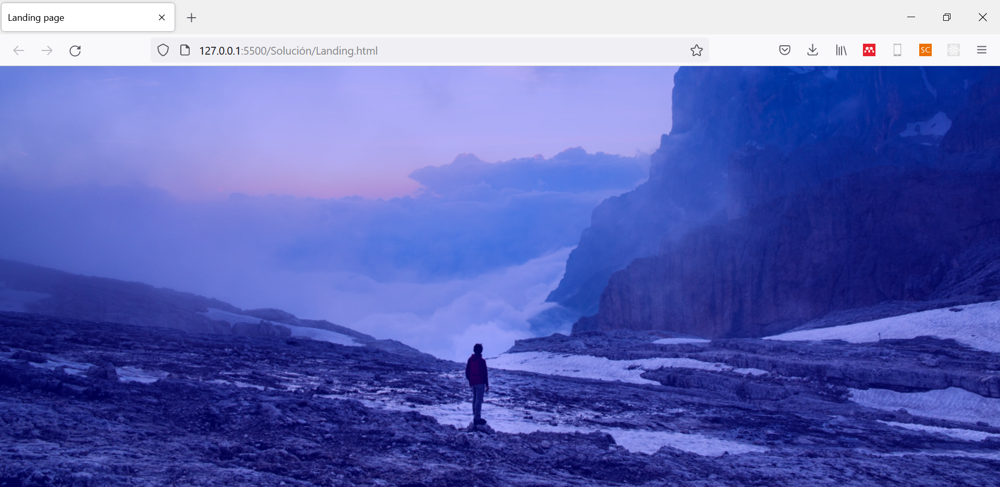
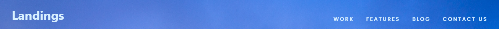
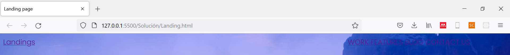
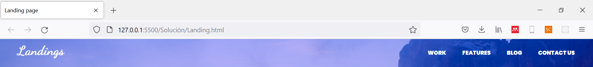
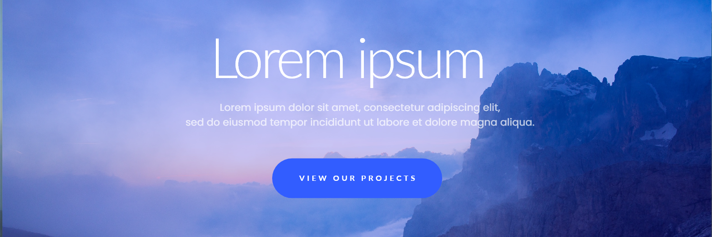
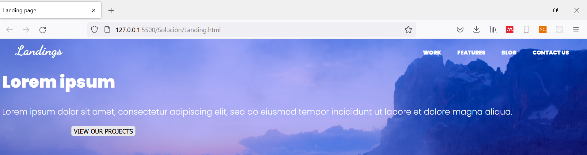
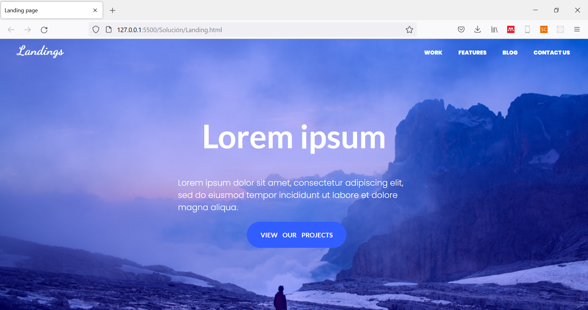

<div align="center">
    <h1>Taller 1</h1>
</div>

## Introducción

En el presente taller, se trabajará con el desarrollo de un proyecto frontend con HTML/CSS. Será un desarrollo _paso a paso_. En un procedimiento de desarrollo de frontend, el primer paso recomendable, para un diseño personalizado, es construir un prototipo con herramientas de diseño, como [Adobe XD](https://helpx.adobe.com/es/xd/get-started.html). Para este taller, construiremos el siguiente [prototipo](https://www.dropbox.com/sh/0eaur6vuiak0tft/AACqNo9STml6pMLs1ga-hBXHa?dl=0).

## 1. Problema

El prototipo que construiremos se trata del _"Landing page"_ genérico de una aplicación web de ejemplo. Esta aplicación se puede apreciar a continuación:



Para la creación del proyecto, debes crear una nueva carpeta en una ubicación de interés con la siguiente estructura:

```
Taller1   
│   Landing.html
|   estilos.css
└───Images
|   └───fondo.png
```

### 1.1. HTML base

El cuerpo genérico de nuestro HTML será:

```HTML
<html>
    <head>
        <title>Landing page</title>
        <meta charset="utf-8">
        <link rel="stylesheet" href="estilos.css">
        <link rel="preconnect" href="https://fonts.googleapis.com">
        <link rel="preconnect" href="https://fonts.gstatic.com" crossorigin>
        <link href="https://fonts.googleapis.com/css2?family=Dancing+Script:wght@500&family=Lato:wght@700&family=Poppins:wght@300;900&display=swap" rel="stylesheet"> 
    </head>
    <body>

    </body>
</html>
```
Como se observa, en la sección de _head_, establecimos el vínculo con nuestro documento de `estilos.css`. Todo nuestro desarrollo, de aquí en adelante, estará contenido en la sección `body`. A su vez, vamos a utilizar diferentes fuentes de Google, entre ellas:

* Poppins
* Dancing Script
* Lato 

## 2. Imagen de fondo

El cuerpo de nuestro documento tiene una imagen de fondo particular. Podemos establecerla como el fondo de nuestro desarrollo de la siguiente forma (en `estilos.css`):

```CSS
body {
    background:linear-gradient(0deg, rgba(0, 0, 255, 0.3), rgba(0, 0, 255, 0.3)), url(./Images/fondo.png);
    background-position: 40% 40%;
    font-family: 'Poppins', sans-serif;
    font-size: 18px;
    color: white;
}
```

Lo que dará como respuesta:



## 3. Cabecera

La cabecera contiene, normalmente, el menú de navegación de nuestro desarrollo. 



### 3.1. HTML

Lo primero que haremos, será construir el desarrollo en HTML. Para ello, usaremos la etiqueta `<nav>`, que se emplea para agrupar las opciones genéricas de una aplicación web.

```HTML
<nav>
    <a class="index" href="">Landings</a>
    <a href="" style="padding-left: 780px;">WORK</a>
    <a href="">FEATURES</a>
    <a href="">BLOG</a>
    <a href="">CONTACT US</a>
</nav>
```

En este punto, la respuesta que tendremos será:



### 3.2. CSS

Para brindarle el contexto estético de nuestra cabecera, aplicaremos los siguientes estilos:

```CSS
a {
    color: white;
    text-decoration: none;
    padding-left: 30px;
    font-size: 12px;
}

.index {
    font-size: 28px;
    font-family: 'Dancing Script', cursive;
}
```

Obteniendo como resultado:



## 4. Cuerpo

El cuerpo de nuestro desarrollo será:



### 4.1. HTML

Nuevamente, iniciaremos construyendo nuestro documento HTML:

```HTML
<div class="cuerpo">
    <h1>Lorem ipsum</h1>
    <p>Lorem ipsum dolor sit amet, consectetur adipiscing elit, 
        sed do eiusmod tempor incididunt ut labore et dolore magna aliqua.</p>
    <div style="padding-left:150px;">
        <button>VIEW OUR PROJECTS</button>
    </div>
</div>
```

El obtenido visual será:



### 4.2. CSS

Aportando los siguientes estilos:

```CSS
.cuerpo {
    margin-left: auto;
    margin-right: auto;
    width: 40%;
    padding-top: 80px;
}

h1 {
    text-align: center;
    font-size: 70px;
    font-family: 'Lato', sans-serif;
}

p {
    padding-top: -10%;
}

button {
    color: white;
    background-color: #325DFF;
    border-radius: 40px;
    font-family: 'Lato', sans-serif;
    font-size: 14px;
    border: none;
    padding-top: 20px;
    padding-bottom: 20px;
    padding-left: 30px;
    padding-right: 30px;
    word-spacing: 8px;
}
```

Obtendremos el resultado final deseado:

