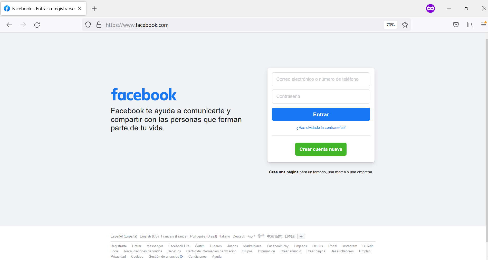
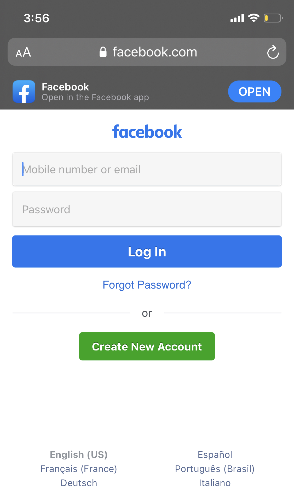
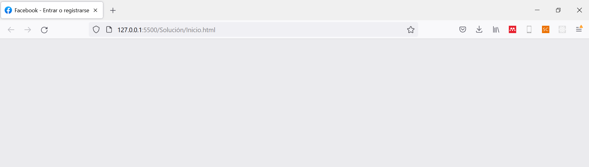
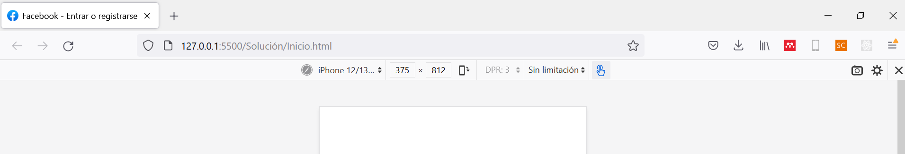
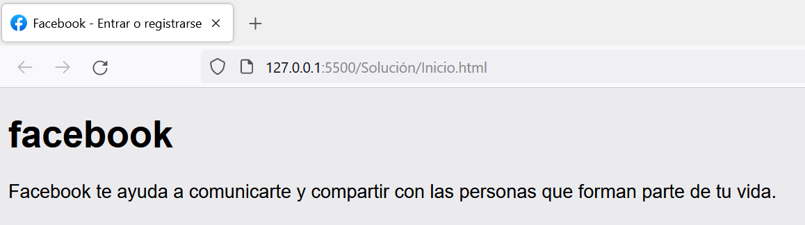
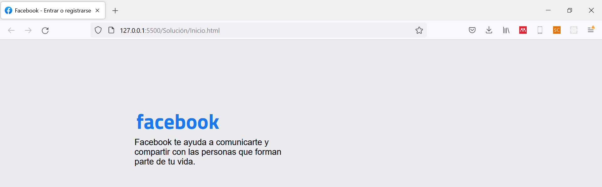
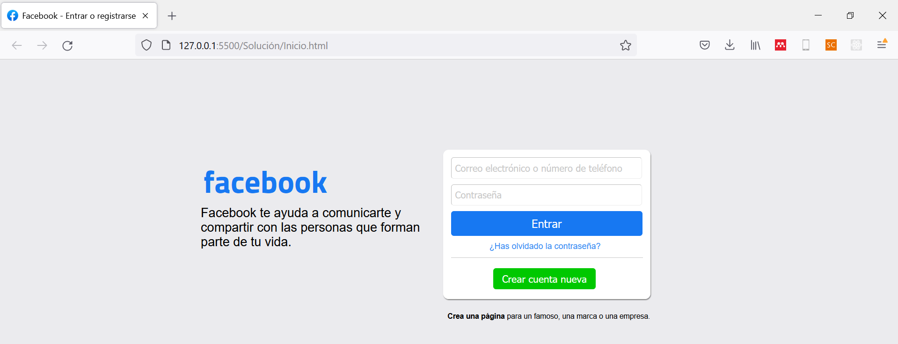
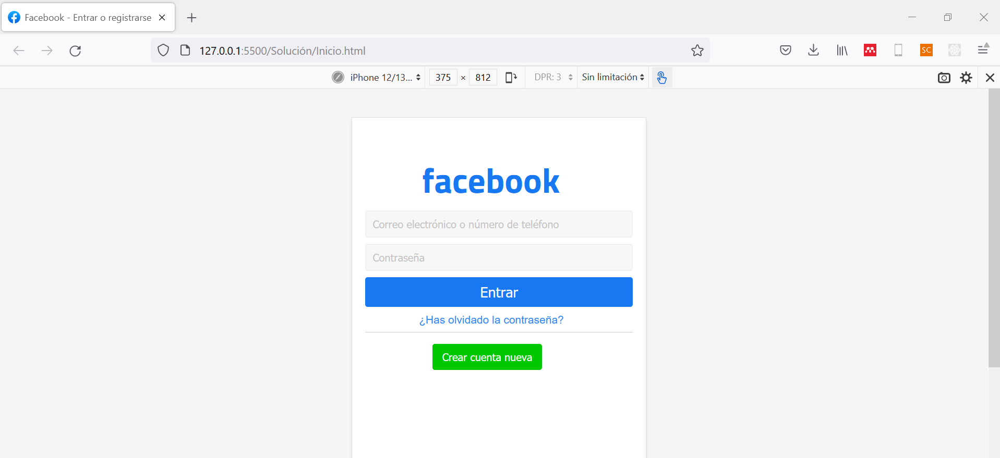
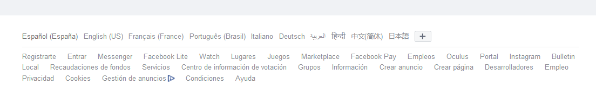
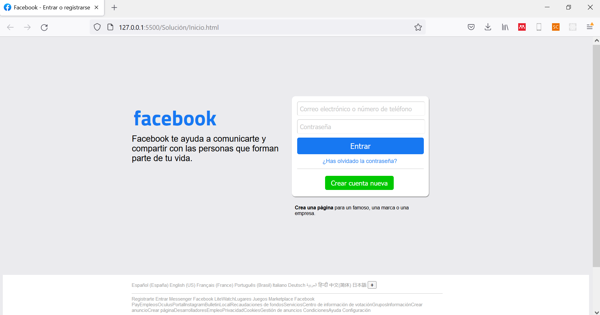

<div align="center">
    <h1>Taller 3 - Diseño Responsive</h1>
</div>

## Introducción

El diseño _responsive_ busca globalizar nuestro desarrollo frontend, de tal forma que el usuario obtenga una respuesta personalizada; dependiendo del tamaño del dispositivo en donde acceda a nuestro producto. Para el presente taller, construiremos una aplicación web con diseño personalizado para tamaño de computador y otro diseño para dispositivos móviles.

## Problema 

Construiremos el _landing page_ de Facebook. Tanto la versión de navegador web como la versión móvil.

<div align="center">
    
    <i>Figura 1.</i> Versión web.
    <br>
    <br>
    <br>
    
    <i>Figura 2.</i> Versión móvil.
</div>

## 1. Generalidades

Lo primero que haremos será crear la carpeta en donde tendremos los arhcivos de nuestro desarrollo frontend.

```
Facebook   
│   Inicio.html
|   estilos.css
|   estilos-mobile.css
└───Images
|   └───logo.jpg
```

El cuerpo de nuestro documento está comprendido en dos zonas específicas: la zona de _inicio de sesión_ y el pie de página que contiene información genérica de nuestra aplicación.

Nuestro desarrollo estará disponible para dos tamaños específicos: dispositivos menores a 600px (celulares) y mayores (tablets y computadoras).

### 1.1. Cuerpo del documento

Empezamos construyendo el cuerpo de nuestro documento HTML de la siguiente forma:

```HTML
<html>
    <head>
        <title>Facebook - Entrar o registrarse</title>
        <meta charset="utf-8">
        <meta name="viewport" content="width=device-width, initial-scale=1.0">
        <link rel="stylesheet" media="screen and (max-width:600px)" href="estilos-mobile.css">
        <link rel="stylesheet" media="screen and (min-width:600px)" href="estilos.css">
        <link rel="shortcut icon" href="https://static.xx.fbcdn.net/rsrc.php/yb/r/hLRJ1GG_y0J.ico">
    </head>
    <body>
        
    </body>
</html>
```

La clave para los diseños personalizados de nuestros desarrollos web y móvil radica en la construcción de dos estilos css distintos, que se ejecutará dependiendo del tamaño de pantalla; para ello, creamos nuestros archivos `estilos.css` y `estilos-mobile.css`. El último `link`, corresponde a la importación del ícono de Facebook en la cabecera de nuestro documento.

### 1.2. CSS genérico

El color de fondo genérico de Facebook es de tipo grisáceo, de forma que en nuestro archivo css (`estilos.css`) tendremos lo siguiente:

```CSS
html {
    background-color: rgb(235, 235, 238);
    font-family: Arial, Helvetica, sans-serif;
    font-size: 16px;
}
```

Lo que nos dará como resultado:



### 1.3. CSS móvil

El color de fondo genérico de Facebook, para la versión móvil, es blanca, de forma que en nuestro archivo css (`estilos-mobile.css`) tendremos lo siguiente:

```CSS
body {
  background-color: white;
  font-family: Arial, Helvetica, sans-serif;
  font-size: 16px;
}
```



Como construiremos diferentes diseños personalizados, dependiendo del tamaño de la pantalla del dispositivo, emplearemos una medida relativa. En CSS existen dos tipos de medidas relativas: `rem` y `em`. La primera, se destaca por tratarse de una medida relativa al tamaño de letra genérico del documento; mientras que la segunda, se trata de una medida relativa al tamaño de letra del componente específico que se esté diseñando.

## 2. Inicio de sesión

### 2.1. Titulo

Iniciamos construyendo el inicio de sesión en nuestro HTML (dentro del `<body></body>`):

```HTML
<div class="cuerpo">
    <div class="titulo">
        <h1 id="logo">facebook</h1>
        <p id="descripcion">Facebook te ayuda a comunicarte y compartir con las personas que forman parte de tu vida.</p>
    </div>
</div>
```

Lo que nos dará como resultado:



#### 2.1.1 CSS genérico

Ahora, aplicaremos los estilos que definen la forma en cómo se verá nuestro producto en computadoras y tablets:

```CSS
.cuerpo {
    padding-top: 8%;
    padding-left: 22%;
}

.titulo {
    width: 35%;
}

#logo {
    color: #1778F2;
    font-size: 2.8rem;
    font-family: 'Titillium Web', sans-serif;
    padding-left: 1%;
}

#descripcion {
    margin-top: -1.8rem;
}
```
Que nos da como resultado:



### 2.2. Formulario inicio de sesión

El formulario de inicio de sesión permite a los usuarios de Facebook crear nuevos perfiles o acceder a perfiles personales.

#### 2.2.1 HTML

Añadiremos a nuestro documento HTML el formulario de inicio de sesión de la siguiente forma:

```HTML
<div class="cuerpo">
    <div class="titulo">
        <h1 id="logo">facebook</h1>
        <p id="descripcion">Facebook te ayuda a comunicarte y compartir con las personas que forman parte de tu vida.</p>
    </div>
    <div class="sesion-form">
        <form method="post">
            <input type="text" placeholder="Correo electrónico o número de teléfono">
            <input type="password" placeholder="Contraseña">
            <br>
            <button class="entrar">Entrar</button>
            <br>
            <div style="padding-top: 0.5rem; padding-left: 20%;">
                <a href="" id="contra">¿Has olvidado la contraseña?</a>
            </div>
            <hr style="border: none; height: 0; border-top: 1px solid rgba(150,150,150,0.5);">
            <button class="cuenta">Crear cuenta nueva</button>
        </form>
        <p style="font-size:10.5px; padding-left:0.4rem;"><a href="" id="crear-pagina">Crea una página</a> para un famoso, una marca o una empresa.</p>
    </div>
</div>
```

#### 2.2.2 CSS genérico

Los estilos personalizados requeridos para la sección del formulario se pueden apreciar a continuación:

```CSS
.sesion-form {
    margin-top: -10rem;
    margin-left: 35%;
    width: 30%;
}

form {
    background-color: white;
    border-radius: 0.5rem;
    padding: 0.7rem;
    box-shadow: 0.5px 1px 1px grey;
}

input {
    padding-left: 2%;
    padding-top: 0.4rem;
    padding-bottom: 0.4rem;
    width: 17rem;
    margin-bottom: 0.5rem;
    border-radius: 0.25rem;
    border-width: 0.5px;
    border-color: rgba(221, 221, 221,0.6);
}

::placeholder {
    color: rgb(150, 150, 150);
}

button {
    border-radius: 0.25rem;
    border-width: 0;
    color: white;
    font-size: 14px;
    font-weight:lighter;
}

.entrar {
    font-size: 16px;
    background-color: #1778F2;
    padding-left: 42%;
    padding-right: 42%;
    padding-top: 0.5rem;
    padding-bottom: 0.5rem;
}

#contra {
    color: #348af3;
    font-size: 12px;
    text-decoration: none;
}

.cuenta {
    background-color: rgb(0, 200, 0);
    margin-left: 22%;
    padding: 2.5%;
    padding-left: 0.8rem;
    padding-right: 0.8rem;
    margin-bottom: 1%;
    margin-top: 2%;
}

#crear-pagina {
    text-decoration: none;
    color:black;
    font-weight: bold;
}

#crear-pagina:hover {
    text-decoration: underline;
}
```

Obteniendo el siguiente resultado:



### 2.3 CSS móvil

Con esta sección, finalizaremos el desarrollo móvil de nuestra _landing page_:

```CSS
.cuerpo {
  padding-top: 2%;
  padding-left: 2.5%;
}

.titulo {
  width: 35%;
}

#logo {
  color: #1778F2;
  font-size: 2.8rem;
  font-family: 'Titillium Web', sans-serif;
  margin-left: 4.5rem;
}

#descripcion {
  font-size: 0;
  margin-top: -20%;
}

.sesion-form {
  width: 97.5%;
}

input {
  width: 100%;
  padding: 0.5rem;
  background-color: rgb(247, 247, 247);
  border: solid rgb(240, 240, 240);
  border-width: 0.1rem;
  border-radius: 0.2rem;
  margin-bottom: 0.5rem;
}

.entrar {
  width: 100%;
  background-color: #1778F2;
  color: white;
  border: none;
  border-radius: 0.2rem;
  padding-top: 0.5rem;
  padding-bottom: 0.5rem;
  font-size: 18px;
}

::placeholder {
  color: rgb(150, 150, 150);
}

#contra {
  color: #348af3;
  text-decoration: none;
  font-size: 14px;
}

hr {
  border: none; 
  height: 0; 
  border-top: 1px solid rgba(150,150,150,0.5);
}

.cuenta {
  color: white;
  background-color: rgb(0, 200, 0);
  margin-left: 25%;
  padding: 2.5%;
  padding-left: 0.8rem;
  padding-right: 0.8rem;
  margin-bottom: 1%;
  margin-top: 2%;
  border: none;
  border-radius: 0.2rem;
}

.crear-pagina {
  font-size:0;
}

footer {
  font-size: 0;
  display:none;
}
```

Que nos dará como resultado:



## 3. Pie de página

El pie de página contiene información genérica de Facebook. Para este caso, se trata de:



Obviaremos esta sección para el desarrollo móvil.

### 3.1. HTML

Crearemos el pie de página mediante la etiqueta `footer`, como se muestra a continuación:

```HTML
<footer>
    <div>
        <p>    Español (España)
            English (US)
            Français (France)
            Português (Brasil)
            Italiano
            Deutsch
            العربية
            हिन्दी
            中文(简体)
            日本語
            <button class="add">+</button>
        </p>
    </div>
    <div class="opciones">
        <hr>
        Registrarte Entrar Messenger Facebook LiteWatchLugares Juegos Marketplace Facebook PayEmpleosOculusPortalInstagramBulletinLocalRecaudaciones de fondosServiciosCentro de información de votaciónGruposInformaciónCrear anuncioCrear páginaDesarrolladoresEmpleoPrivacidadCookiesGestión de anuncios
CondicionesAyuda
Configuración
    </div>
</footer>
```

### 3.2. CSS general

Los estilos necesarios para el pie de página son:

```CSS
footer {
    color: rgb(150, 150, 150);
    font-size: 10px;
    background-color: white;
    margin-top: 10%;
    padding-bottom: 100px;
    padding-left: 22%;
    padding-top: 0.2rem;
}

.opciones {
    width: 68%;
}

.add {
    font-size: 10px;
    background-color: rgb(245, 245, 245);
    color: black;
    font-weight: bold;
    padding-left: 0.3rem;
    padding-right: 0.3rem;
    padding-top: 0.1rem;
    padding-bottom: 0.1rem;
    border: grey solid;
    border-radius: 0.1rem;
    border-width: 0.01rem;
}
```

Que nos dará como resultado:

